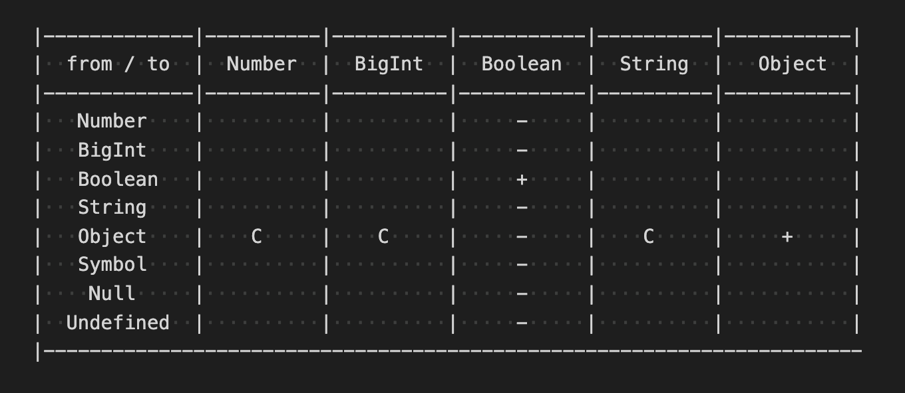
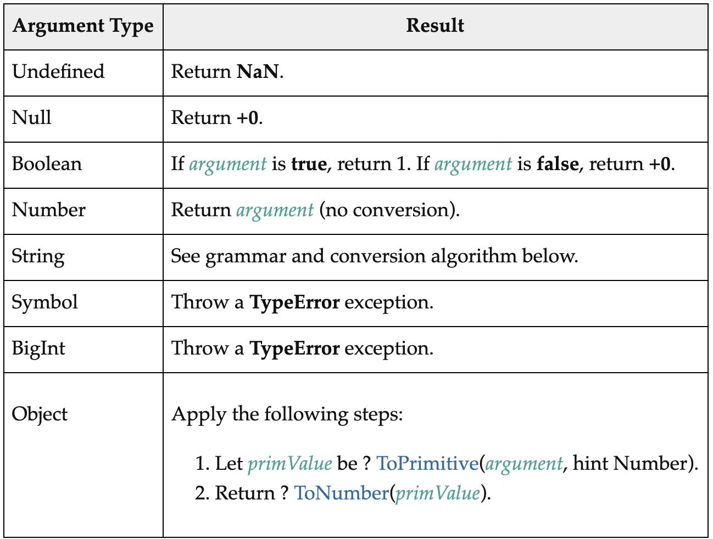

Насколько JavaScript сильный?
=============================

Погружение в тему неявных преобразований. Где и как возникают и вычисляются
неявные преобразования в JavaScript? Возможно ли средствами языка сделать сам
JavaScript сильнее?


[Альбрехт Дюрер. Гравюра «Носорог» (1515)](https://ru.wikipedia.org/wiki/%D0%9D%D0%BE%D1%81%D0%BE%D1%80%D0%BE%D0%B3(%D0%B3%D1%80%D0%B0%D0%B2%D1%8E%D1%80%D0%B0_%D0%94%D1%8E%D1%80%D0%B5%D1%80%D0%B0)#/media/%D0%A4%D0%B0%D0%B9%D0%BB:D%C3%BCrer's_Rhinoceros,_1515.jpg)

**tl; dr**

В JavaScript все преобразования между типами сводятся к выполнению абстрактных операторов приведения типов, например,
[ToBoolean](https://tc39.es/ecma262/#sec-toboolean), [ToNumber](https://tc39.es/ecma262/#sec-tonumber), [ToBigInt](https://tc39.es/ecma262/#sec-tobigint) и так далее. Несмотря на представление о том, что в JavaScript «можно сложить что угодно с чем угодно», в языке существуют ошибки приведения типов. Из всех приведений типов **только приведение типа **[Object](https://tc39.es/ecma262/#sec-object-type)** возможно контролировать.**

## Сильная и слабая типизация

Понятие «сильная типизация» (или иногда еще говорят «строгая типизация») не имеет одного определения, существует несколько различных трактовок. Однако какими бы ни были эти трактовки, они** **все **связаны с приведением типов**.

Когда в языке программирования разрешены вычисления только между значениями одного и того же типа, тогда будем называть этот язык абсолютно строгим. Другими словами в выражениях не должно происходить смешения типов и неявных преобразований. В строгом языке при вычислениях между значениями разных типов, значения должны быть явно приведены разработчиком к одному типу (**Type Casting**), в ином случае мы получим ошибку совместимости типов.

Будем называть абсолютно слабыми те языки программирования, в которых вычисления могут происходить между значениям абсолютно любых типов, причем всегда. Другими словами в вычислениях значений разных типов происходят неявные приведения типов (**Type Coercion**) к одному типу без участия разработчика, согласно правилам приведения в этом языке программирования.

Однако сложно найти абсолютно сильный язык. Как правило даже в сильных язык может присутствовать незначительное количество неявных приведений, [например в C#](https://docs.microsoft.com/ru-ru/dotnet/csharp/language-reference/builtin-types/numeric-conversions#implicit-numeric-conversions):

```javascript
using System;

class CoercionExampleClass {
    public static void Main () {
        float x = 10.5f;
        int y = 20;

        Console.WriteLine ("x with type {0} is {1}", x.GetType(), x);
        Console.WriteLine ("y with type {0} is {1}", y.GetType(), y);

        x = y; // неявное преобразования значения float в int

        Console.WriteLine ("x with type {0} is {1}", x.GetType(), x);
        Console.WriteLine ("y with type {0} is {1}", y.GetType(), y);
    }
}
```

В примере выше, переменные будут сохранять свои типы, однако значение 10.5f типа float будет заменено на значение 20 типа int. [Запустить исходники в repl.it](https://repl.it/@ufocoder/C-Sharp-Coercion)

Возвращаясь к типизации, дополню, что также сложно найти абсолютно слабый язык, в слабых языках могут быть недопустимы некоторые преобразования между типами, например в JavaScript:

```javascript
1n + true  // TypeError
           // Cannot mix BigInt and other types, 
           // use explicit conversions
```

В сети можно встретить множество иллюстраций шкалы слабой/сильной типизации одновременно с шкалой статической/динамической типизации.


[Magic lies here — Statically vs Dynamically Typed Languages](https://android.jlelse.eu/magic-lies-here-statically-typed-vs-dynamically-typed-languages-d151c7f95e2b)

Здесь стоит обратить внимание, что нет связи между слабой/сильной типизацией и динамической/статической. Например, Python имеет сильную динамическую типизацию, а C — слабую статическую.

## Явные и неявные приведения в JavaScript

JavaScript является слабо типизированным языком — это означает, что в нем выполняется множество неявных преобразований.

Когда в выражениях языка используются встроенные функции или операции с разными типами аргументов, JavaScript пытается привести аргументы к одному типу и произвести вычисления, например:

```javascript
42 + " is answer"            // "42 is answer"
40 + [2]                     // "402"
1 / 0 + ""                   // "Infinity"
42 || false                  // 42
42 + { valueOf: () => 46 }   // 88
42 ? false : 1n              // false
```

Из-за этой особенности JavaScript стал источником многих мемов:


Гравюра «Патрик и приведение типов». Объяснение в конце статьи

В JavaScript можно приводить значения явно. Так для каждого типа данных, кроме null и undefined, существует одноименная функция, которая при вызове приведет аргумент к этому типу данных:

```javascript
Number("0x42") + 34              // 100
BigInt("42")                     // 42n
Boolean(0)                       // false
String("42") + " is answer"      // "42 is answer"
Object("42")                     // String {"42"}
```

Несмотря на то что в языке можно складывать практически что угодно с чем угодно, **существуют ошибки приведения типов**, как пример, в приведенном выше выражении `1n + true`.

## Что значит «‎сделать JavaScript сильнее»?

Если в JavaScript существует возможность контролировать неявные преобразования, тогда можно создать ошибку типов. Возможность этого контроля и позволит нам сделать язык «сильнее», другими словами сократить количество неявных преобразований.

Поэтому необходимо определиться с тем, какие в языке есть типы, какие могут быть преобразования между этими типами, и надо разобраться, когда и как происходят приведения типов.

## «Таблица строгости»

В JavaScript присутствуют примитивные типы: [Number](https://tc39.es/ecma262/#sec-ecmascript-language-types-number-type), [BigInt](https://tc39.es/ecma262/#sec-ecmascript-language-types-bigint-type), [Boolean](https://tc39.es/ecma262/#sec-ecmascript-language-types-boolean-type), [String](https://tc39.es/ecma262/#sec-ecmascript-language-types-string-type), [Null](https://tc39.es/ecma262/#sec-ecmascript-language-types-null-type), [Undefined](https://tc39.es/ecma262/#sec-ecmascript-language-types-undefined-type), [Symbol](https://tc39.es/ecma262/#sec-ecmascript-language-types-string-type) и один непримитивный тип [Object](https://tc39.es/ecma262/#sec-object-type) — итого 8 типов данных.

Перемножив 8 на 8, мы получаем, что необходимо рассмотреть 64 комбинации преобразований между типами. Так мы получим таблицу возможных преобразований:


Затем необходимо определить, какие преобразования существуют в языке, какие недопустимы, и какие мы можем ограничить.

Как мы будем заполнять таблицу? Отметим в ячейке:

* **«E»** (от англ. **E**rror), когда согласно спецификации преобразование
недопустимо и происходит ошибка приведения типов [TypeError](https://tc39.es/ecma262/#sec-native-error-types-used-in-this-standard-typeerror);
* «**C**» (от англ. **C**ontroller), когда средствами языка мы можем отменить преобразование и вызвать ошибку приведения типа — [TypeError](https://tc39.es/ecma262/#sec-native-error-types-used-in-this-standard-typeerror)*;*
* «**–**» (минус), когда происходит приведение типов;
* «**+**» (плюс), когда нет приведения типов.

Другими словами мы отмечаем те комбинации преобразований, которые можем исключить из потенциально неявных. Все ячейки со знаком минус будут относится к потенциально неявным.

Поэтому таблицу приведения типов, которую мы будем заполнять, в каком-то смысле можно называть «таблицей строгости».

## **Абстрактные операторы**

В спецификации [ECMAScript](https://tc39.es/ecma262/) присутствуют полиморфные абстрактные операторы. Эти операторы недоступны напрямую в JavaScript, но вызываются опосредованно через его синтаксис. Среди таких абстрактных операторов существует группа операторов занимающихся приведением типов ([Type Conversion](http://Permalink)).

**Абстрактные операторы приведения типов используются при неявных приведениях типов в выражениях.**

К таким операторам относятся [ToPrimitive](https://tc39.es/ecma262/#sec-toprimitive), [ToBoolean](https://tc39.es/ecma262/#sec-toboolean) и так далее:

```
7 Abstract Operations
7.1 Type Conversion
7.1.1 ToPrimitive ( input [ , PreferredType ] )
7.1.2 ToBoolean ( argument )
7.1.3 ToNumeric ( value )
7.1.4 ToNumber ( argument )
7.1.5 ToInteger ( argument )
7.1.6 ToInt32 ( argument )
7.1.7 ToUint32 ( argument )
7.1.8 ToInt16 ( argument )
7.1.9 ToUint16 ( argument )
7.1.10 ToInt8 ( argument )
7.1.11 ToUint8 ( argument )
7.1.12 ToUint8Clamp ( argument )
7.1.13 ToBigInt ( argument )
7.1.14 StringToBigInt ( argument )
7.1.15 ToBigInt64 ( argument )
7.1.16 ToBigUint64 ( argument )
7.1.17 ToString ( argument )
7.1.18 ToObject ( argument )
7.1.19 ToPropertyKey ( argument )
7.1.20 ToLength ( argument )
7.1.21 CanonicalNumericIndexString ( argument )
7.1.22 ToIndex ( value )
```

В спецификации большая часть абстрактных операторов использует другие
абстрактные операторы:

```
ToPrimitive
ToBoolean
ToNumeric                    использует ToNumber, ToPrimitive
ToNumber
ToInteger                    использует ToNumber
ToInt32                      использует ToNumber
ToUint32                     использует ToNumber
ToInt16                      использует ToNumber
ToUint16                     использует ToNumber
ToInt8                       использует ToNumber
ToUint8                      использует ToNumber
ToUint8Clamp                 использует ToNumber
ToBigInt                     использует ToPrimitive, StringToBigInt
StringToBigInt
ToString
ToObject
ToPropertyKey                использует ToPrimitive, ToString
ToLength                     использует ToNumber, ToString
CanonicalNumericIndexString  использует ToInteger
ToIndex                      использует ToInteger, ToLength
```

Поэтому можно сократить список операторов, оставив только: [ToPrimitive](https://tc39.es/ecma262/#sec-toprimitive), [ToBoolean](https://tc39.es/ecma262/#sec-toboolean), [ToNumber](https://tc39.es/ecma262/#sec-tonumber), [ToBigInt](https://tc39.es/ecma262/#sec-tobigint), [ToString](https://tc39.es/ecma262/#sec-tostring), [ToObject](https://tc39.es/ecma262/#sec-toobject). Это поможет нам легче разобраться в неявных приведениях типов в JavaScript.

Из списка операторов выше, убрал все те операторы, которые используют другие операторы. Однако, несмотря на то, что [StringToBigInt](https://tc39.es/ecma262/#sec-stringtobigint) сам ничего не использует, он был исключен из рассматриваемых, поскольку кроме как внутри [ToBigInt](https://tc39.es/ecma262/#sec-tobigint) нигде не используется. Более того у оператора [ToBigInt](https://tc39.es/ecma262/#sec-tobigint) есть своя таблица приведения.

Как уже было упомянуто выше, абстрактные операторы приведения типов являются полиморфными, то есть в зависимости от типов аргументов в них происходит переключение на нужное преобразование. На уровне спецификации это представлено в виде таблицы преобразования.

## Внутренние слоты и методы в ECMAScript

Абстрактные операторы используются в момент вызова обычных операторов, других абстрактных операторов и внутренних методов. Поэтому прежде чем перейти к рассмотрению абстрактных операторов, необходимо разобраться с еще одним понятием.

Если вы хоть раз читали спецификацию ECMAScript, то наверняка встречали выражения в квадратных скобках, например, `[[DefineOwnProperty]]`, `[[HasProperty]]`, `[[Get]]`, `[[Set]]`, `[[Delete]]` и тому подобное. Таким способом в спецификации обозначаются внутренние слоты (**internal slot**) или внутренние методы (**internal methods).**

[Внутренние слоты и внутренние методы](https://tc39.es/ecma262/#sec-object-internal-methods-and-internal-slots)— это псевдосвойства и псевдометоды, которые используются для определения состояния и поведения для связанных с ним объектов.

Например, каждое значение типа [Symbol](https://tc39.es/ecma262/#sec-ecmascript-language-types-symbol-type) содержит ассоциированный с ним внутренние слот`[[Description]]`. Внутренний слот имеет значение `undefined` или строковое значение, которое является результатом применения абстрактного оператора [ToString](https://tc39.es/ecma262/#sec-tostring) над значением аргумента `description` функции конструктора [Symbol](https://tc39.es/ecma262/#sec-symbol-constructor):


Теперь вам будет не так страшно читать спецификацию ECMAScript, в частности то, как работают абстрактные операторы.

## Сокращение «таблицы строгости».

Поскольку среди абстрактных операторов **не существует операторов ToNull, ToUndefined, ToSymbol**, то мы можем смело откинуть соответствующие колонки в «таблице строгости»:


Количество преобразований между типами сократилось с 64 до 40.

Из таблицы выше и списка абстрактных операторов следует, что существует преобразования к 5 типам. Причем за каждым преобразованием стоит конкретный абстрактный оператор. Давайте теперь разберёмся с ними.

## **Порядок рассмотрения абстрактных операторов**

При рассмотрении сокращенного списка операторов приведения типов будем придерживаться следующего плана:

* укажем функции, методы, скрытые методы или операторы, где используется рассматриваемый абстрактный оператор приведения.
* определим, между какими типами операции приведения допустимы или недопустимы, какие контролируемые, какие нет, какие из них вызывают ошибку типов, далее отметим это в таблице строгости.

## Абстрактный оператор ToBoolean

Оператор [ToBoolean](https://tc39.es/ecma262/#sec-toboolean) используется внутри
следующих операторов и внутренних слотов и методов, большая часть из них:

```
// Логические операторы

const expression = 'answer is 42'

!expression              // унарный  логический оператор NOT
expression || expression // бинарный логический оператор OR
expression && expression // бинарный логический оператор AND

// Примеры:

!42                 // значение 42 будет приведено к типу Boolean
42 && 'is answer'   // значение 42 будет приведено к типу Boolean
                    // 'is answer' будет приведено к типу Boolean
                    // результат выражения - значение 'is answer'
42 || 'is answer'   // значение 42 будет приведено к типу Boolean
                    // результат выражения - значение 42

// Условный оператор ( ? : )

const result = expression // expression будет приведено к Boolean
  ? 'expression is true'
  : 'expression is false'

// Выражение if

if (expression) {        // expression будет приведено к Boolean
  /* .. */
}

// Методы массива

Array.prototype.filter  // результат callback приводится к boolean
Array.prototype.some    // результат callback приводится к boolean

// Внутренние методы и внутренние слоты объекта Proxy

[[SetPrototypeOf]]
[[IsExtensible]]
[[HasProperty]]
[[PreventExtensions]]
[[DefineOwnProperty]]
[[HasProperty]]
[[Set]]
[[Delete]]

// Абстрактный оператор IsRegExp
```

Рассмотрим один из операторов, который использует абстрактный оператор [ToBoolean](https://tc39.es/ecma262/#sec-toboolean). Ниже, согласно спецификации, описывается унарный логический оператор NOT:


В дальнейшем мы не будем рассматривать описание каждого такого оператора, при необходимости вы можете ознакомится с каждым из них самостоятельно.

Ниже представлена таблица преобразований для [ToBoolean](https://tc39.es/ecma262/#sec-toboolean):


ECMAScript 2021. 7.1.2 ToBoolean. Table 10: [ToBoolean](https://tc39.es/ecma262/#table-10) Conversions

Отсюда видно, что на уровне языка мы не можем контролировать неявные преобразования для [ToBoolean](https://tc39.es/ecma262/#sec-toboolean). Какого бы типа не был аргумент оператора, для него явно описан способ преобразования.

Заполняем таблицу:


Единственный плюс в таблице означает, что при преобразовании из [Boolean](https://tc39.es/ecma262/#sec-terms-and-definitions-boolean-type) в [Boolean](https://tc39.es/ecma262/#sec-terms-and-definitions-boolean-type), мы получаем изначальное значение *argument*, переданное функции [ToBoolean](https://tc39.es/ecma262/#sec-toboolean), то есть здесь не происходит неявного преобразования, что очевидно.

## Абстрактный оператор ToPrimitive

Прежде чем переходить к другим абстрактным операторам, необходимо рассмотреть используемый этими абстрактными операторами приведения типа оператор [ToPrimitive](https://tc39.es/ecma262/#sec-toprimitive).

Оператор [ToPrimitive](https://tc39.es/ecma262/#sec-toprimitive) используется во множестве других операторах, не только операторах приведения типа, например:

```
ToNumeric
ToNumber
ToBigInt
ToString
ToPropertyKey
Date function
Date.prototype.toJSON
Abstract Relational Comparison: >, <
Abstract Equality Comparison: ==
ApplyStringOrNumericBinaryOperator: **, *, /, %, +, -, <<, >>, >>>, &, ^, |
```

Если применить оператор для значения примитивного типа, то будет возвращено исходное значение без преобразований, использование оператора [ToPrimitive](https://tc39.es/ecma262/#sec-toprimitive) имеет смысл для значения типа [Object](https://tc39.es/ecma262/#sec-object-type).

Для объектов работа оператора [ToPrimitive](https://tc39.es/ecma262/#sec-toprimitive) сводится к выбору типа, к которому необходимо привести значение.

Если у объекта был указан метод `Symbol.toPrimitive`, тогда этот метод будет вызван с двумя аргументами: текущий объект и предпочитаемый к приведению тип. Если у объекта не был указан такой метод, тогда происходит вызов абстрактного оператора `OrdinaryToPrimitive` с передачей в аргументах текущего объекта и типа, к которому следует привести объект.

Вот описание оператора [ToPrimitive](https://tc39.es/ecma262/#sec-toprimitive) из спецификации:


Далее подходя к вопросу добавления строгости в JavaScript, чтобы «отменить» преобразование объекта к примитивному типу достаточно переопределить `Object.prototype[Symbol.toPrimitive]`. Определив метод `Symbol.toPrimitive`, нам не придется погружаться в работу оператора [OrdinaryToPrimitive](https://tc39.es/ecma262/#sec-ordinarytoprimitive).


```
Object.prototype[Symbol.toPrimitive] = () => {
    throw new TypeError('Coercion is disabled')
}
```

В качестве проверки мы можем явным образом попытаться преобразовать объекты
через вызовы соответствующих функций:

```javascript
Boolean({}) // true, результат абстрактного оператора 

Number({})  // Uncaught TypeError: Coercion is disabled
BigInt({})  // Uncaught TypeError: Coercion is disabled
String({})  // Uncaught TypeError: Coercion is disabled
Symbol({})  // Uncaught TypeError: Coercion is disabled

Object({})  // {}
```

Как видим, присутствует одно неконтролируемое преобразование из [Object](https://tc39.es/ecma262/#sec-object-type) в [Boolean](https://tc39.es/ecma262/#sec-ecmascript-language-types-boolean-type), которое мы уже отметили в таблице, и три контролируемых преобразования благодаря
работе [ToPrimitive](https://tc39.es/ecma262/#sec-toprimitive).

Контролируемые преобразования отметим символом **C** (от Controlled):



Существует ложное утверждение, что объекты никогда не приводятся неявно, то есть сначала объекты преобразуются в примитивное значение с помощью [ToPrimitive](https://tc39.es/ecma262/#sec-toprimitive), а затем уже полученное примитивное значение приводится неявно. Однако вызов [ToPrimitive](https://tc39.es/ecma262/#sec-toprimitive) происходит внутри абстрактных операторов [ToNumber](https://tc39.es/ecma262/#sec-tonumber), [ToString](https://tc39.es/ecma262/#sec-tostring), [ToBigInt](https://tc39.es/ecma262/#sec-tobigint), поэтому утверждение, что объекты никогда не приводятся неявно, ошибочно.

## Абстрактный оператор **ToBigInt**

Согласно спецификации оператор используется при вызове других абстрактных операторов, в частности при вызове абстрактного оператора сравнения и оператора проверки на равенство:

```javascript
// Абстрактный оператор сравнения

"2n" > 1n   // "2n" будет приведено неявно к 2n

// Абстрактный оператор проверки на равенство

"3n" == 3n  // "3n" будет приведено неявно к 3n
```

Кстати этот оператор упоминается в спецификации меньше всего, из рассматриваемых нами абстрактных операторов приведения типов.

Описание работы оператора [ToBigInt](https://tc39.es/ecma262/#sec-tobigint) согласно спецификации:


В этом описании мы видим [ToPrimitive](https://tc39.es/ecma262/#sec-toprimitive), но мы уже рассмотрели его выше, поэтому перейдём к [ToBigInt](https://tc39.es/ecma262/#sec-tobigint):


ECMAScript 2021. 7.1.13 ToBigInt. Table 12: [BigInt](https://tc39.es/ecma262/#table-tobigint) Conversions

Из таблицы преобразований выше следует, что приведение значений типа `Undefined`, `Null`, `Number`, `Symbol` вызовет ошибку [TypeError](https://tc39.es/ecma262/#sec-native-error-types-used-in-this-standard-typeerror), поэтому в таблице для этих преобразований поставим «E», здесь язык проявляет строгость.

Также поставим плюс для приведения из [BigInt](https://tc39.es/ecma262/#sec-terms-and-definitions-bigint-type) в [BigInt](https://tc39.es/ecma262/#sec-terms-and-definitions-bigint-type), поскольку неявного преобразования значений не происходит.


Добавилось четыре приведения, которые вызывают ошибку типов, и два неконтролируемых приведения.

## ECMAScript BigInt conversion issue

В спецификации в разделе [7.1 Type Conversion](https://tc39.es/ecma262/#sec-type-conversion) присутствует абзац:

```
The BigInt type has no implicit conversions in the ECMAScript language; programmers must call BigInt explicitly to convert values from other types.
```

В нём говорится, что не существует неявных преобразований для типа данных BigInt, разработчики должны явно вызывать функцию [BigInt](https://tc39.es/ecma262/#sec-bigint-constructor) чтобы привести к типу BigInt из других типов.

На мой взгляд **формулировка не точная**, в цитате говорится, что неявных приведений нет, одновременно с тем, что мы можем найти неявные приведения типов в BigInt в таких выражениях как:


```javascript
"1n" > 1n      // значение "1n" будет приведено в 1n типа BigInt 
"2n" == 2n     // значение "2n" будет приведено в 2n типа BigInt
true == 1n     //  значение true будет приведено в 1n типа BigInt
false == 0n    // значение false будет приведено в 0n типа BigInt
```

Также там говорится, что разработчик должен явно приводить значения:

```javascript
const a0 = BigInt(false)   // 0n
const a1 = BigInt(true)    // 1n
const a2 = BigInt('2')     // 2n
const a3 = BigInt('3')     // 3n
```

Здесь я увидел противоречие и завёл соответствующее [issue](https://github.com/tc39/ecma262/issues/2102) в репозитории [tc39](https://github.com/tc39), где попытался получить соответсвующие комментарии от участников [tc39](https://github.com/tc39) касательно смысла формулировки.

По окончанию диалога, стал подозревать, что спецификация подразумевает, что нет возможности сохранить результат неявного приведения в переменную c типом BigInt. Но это ли имеется ввиду или нет, можно только догадываться…

## Абстрактный оператор ToNumber

Вызов абстрактного оператора [ToNumber](https://tc39.es/ecma262/#sec-tonumber), может происходить при использовании следующих операторов, функций и методов:

```
Унарные операторы

+"42"  -  унарный оператор +
-"42"  -  унарный оператор -
~"10"  -  побитовый оператор NOT

Абстрактные операторы приведения типов:

ToNumeric
ToInteger
ToInt32
ToUint32
ToInt16
ToUint16
ToInt8
ToUint8
ToUint8Clamp

Глобальные функции:

Функция isFinite
Функция isNaN

Методы объекта Math // вызывается ToNumber для каждого аргумента:

Math.max
Math.min
Math.pow

Методы объекта Date.prototype

Date
Date.UTC
Date.prototype.setDate
Date.prototype.setFullYear
Date.prototype.setYear
Date.prototype.setHours
Date.prototype.setMilliseconds
Date.prototype.setMinutes
Date.prototype.setMonth
Date.prototype.setSeconds
Date.prototype.setTime
Date.prototype.setUTCDate
Date.prototype.setUTCFullYear
Date.prototype.setUTCHours
Date.prototype.setUTCMilliseconds
Date.prototype.setUTCMinutes
Date.prototype.setUTCMonth
Date.prototype.setUTCSeconds

Методы объекта String и String.prototype

String.fromCodePoint
String.prototype.lastIndexOf
```

Таблица преобразований оператора [ToNumber](https://tc39.es/ecma262/#sec-tonumber):



ECMAScript 2021. 7.1.4 [ToNumber](https://tc39.es/ecma262/#sec-tonumber). Table 11: [ToNumber](https://tc39.es/ecma262/#table-11) Conversions

Давайте обновим нашу «таблицу строгости»:


## **Абстрактный оператор ToString**

[ToString](https://tc39.es/ecma262/#sec-tostring) — это самый часто используемый абстрактный оператор приведения типов в спецификации. Перечислю часть операторов, функций, методов и внутренних методов, где используется оператор:

```
String
parseFloat
parseInt
decodeURI
decodeURIComponent, 
encodeURI
encodeURIComponent
Symbol
Symbol.for
Error
Number.prototype.toPrecision
Number.prototype.toString
BigInt.prototype.toString
Date.parse
String.prototype.concat
String.prototype.endsWith

ApplyStringOrNumericBinaryOperator: **, *, /, %, +, -, <<, >>, >>>, &, ^, |
[[OwnPropertyKeys]]
```

Не следует путать абстрактный оператор [ToString](https://tc39.es/ecma262/#sec-tostring) с методами [Object.prototype.toString](https://tc39.es/ecma262/#sec-object.prototype.tostring), [Number.prototype.toString](https://tc39.es/ecma262/#sec-number.prototype.tostring), [Error.prototype.toString](https://tc39.es/ecma262/#sec-error.prototype.tostring) и так далее.


ECMAScript 2021. 7.1.17 [ToString](https://tc39.es/ecma262/#sec-tostring). Table 13: [ToString](https://tc39.es/ecma262/#table-12) Conversions

Заполняем «таблицу строгости»:


## Абстрактный оператор ToObject

На удивление, существуют операции, в которых примитивы приводятся к типу [Object](https://tc39.es/ecma262/#sec-object-type) c помощью абстрактного оператора приведения [ToObject](https://tc39.es/ecma262/#sec-toobject). Однако таких операций не так много:


Примеры неявного приведения [ToObject](https://tc39.es/ecma262/#sec-toobject):

```javascript
Object.entries(1)        // []
Object.entries(1n)       // []
Object.values("2")       // ["2"]
Object.values(true)      // []
Object.values(Symbol())  // []
```

Напомню, что массив также является объектом.

Таблица преобразований оператора [ToObject](https://tc39.es/ecma262/#sec-toobject):


ECMAScript 2021. 7.1.2 [ToObject](https://tc39.es/ecma262/#sec-toobject). Table 10: [ToBoolean](https://tc39.es/ecma262/#table-13) Conversions

Заполняем «таблицу строгости»:


## Выводы в цифрах

Из 40 возможных приведений типов имеем:

* 3 контролируемых преобразования за счет работы абстрактного оператора [ToPrimitive](https://tc39.es/ecma262/#sec-toprimitive);
* **5 явных приведения**, поскольку приведения происходят между значениями одного и того же типа **значения не преобразуются**;
* 9 преобразований типов невозможны — возникает ошибка [TypeError](https://tc39.es/ecma262/#sec-native-error-types-used-in-this-standard-typeerror)*;*
* 23 неконтролируемых приведения типов.

**Можно ли сделать JavaScript средствами JavaScript сильнее? **Крайне незначительно, всего 3 контролируемых приведения типов для типа [Object](https://tc39.es/ecma262/#sec-object-type) на фоне 35 неявных для других типов преобразований.

**Насколько JavaScript сильный/слабый? **Полученная «таблица строгости» и является ответом на вопрос относительно существующих приведений типов в языке.

В остальном на основе таблицы мы можем делать некоторые умозрительные выводы, например, что более половины возможных приведений в JavaScript могут быть неявными.

Чтобы сравнивать насколько JavaScript сильнее/слабее относительно другого языка, необходимо изучить как происходят неявные приведения типов в этом другом языке. Далее необходимо взять точку отсчета для сравнения, например, число возможных неявных приведений относительно числа всех возможных приведений.

Однако это уже совсем другая история :)

## Дополнительно: объяснение мема

Напомню, речь идет об истинных выражениях `0 == “0”` и `0 == []`, откуда логично предположить, что `“0” == []`, однако это предположение является ложным.

**Так почему если **`0 == “0”`** и **`0 == []`**, то **`“0” != []`** ?**

Все дело в алгоритме абстрактной проверки на равенство [7.2.14 Abstract Equality Comparison](https://www.ecma-international.org/ecma-262/9.0/#sec-abstract-equality-comparison). Существует довольно полезный инструмент — [JavaScript loose comparison (==) step by step](https://felix-kling.de/js-loose-comparison/), который наглядно показывает, как согласно спецификации исполняется алгоритм сравнения.


Выполнение алгоритма [Abstract Quality Comparison](https://www.ecma-international.org/ecma-262/9.0/#sec-abstract-equality-comparison) для выражения “0” == []

## Благодарности

* [Александр Мышов](https://twitter.com/myshov), [defront.ru](http://defront.ru) — вычитка и редактирование;
* [Андрей Мелихов](https://twitter.com/amel_true), [t.me/devSchachtChannel](https://t.me/devSchachtChannel) — ревью статьи.

## Материал для изучения

* [Ликбез по типизации в языках программирования](https://habr.com/ru/post/161205/);
* [Преобразование типов в JavaScript](https://medium.com/@sergeybulavyk/преобразование-типов-в-javascript-35a15ddfc333), перевод статьи [Alexey Samoshkin](https://medium.com/@alexeysamoshkin)[JavaScript type coercion explained](https://medium.com/@ashbygreg/understanding-javascript-coercion-in-5-easy-steps-347f9f1a4e36);
* [JavaScript loose comparison (==) step by step](https://felix-kling.de/js-loose-comparison/);
* [JavaScript equality table](https://dorey.github.io/JavaScript-Equality-Table/).
