### Полиморфизм простыми словами

Скорее всего вы уже встречались с понятием «полиморфизм» и даже помните пример с наследованием кошек и собак от Animal или квадратов и кругов от Shape. Однако эти примеры показывают далеко не всё, что скрывается за полиморфизмом.


[Jonstonus, Joannes: “A description of the nature of four-footed beasts”](https://www.fromoldbooks.org/Jonstonus-FourFootedBeasts/)

**Как читать статью? **Статья большая, пытайтесь читать ее частями, не забывайте обращать внимание на сопровождающие статью ссылки.

**Благодарности**

* [Александр Мышов](https://twitter.com/myshov), [t.me/defront](https://t.me/defront) — редактирование статьи;
* [Даня Рогозин](https://twitter.com/p_morphism) — консультация по теоретическим вопросам;
* [Виталий Брагилевский](https://bravit.guru/) — консультация по теоретическим вопросам;
* [Дмитрий Свиридкин](https://twitter.com/Nekrolm) — примеры кода на C++.

**Дисклеймер**

Чтобы у вас было представление об авторе данной заметки, предупреждаю, что не являюсь специалистом в области Computer Science, поэтому в статье могут присутствовать умышленные или неумышленные допущения.

Данная статья это попытка раскрыть тему с** минимальными использованием сложных терминов и сложной теории**, чтобы сделать ее максимально доступной.

Отсюда в статье не будет подобных формул:

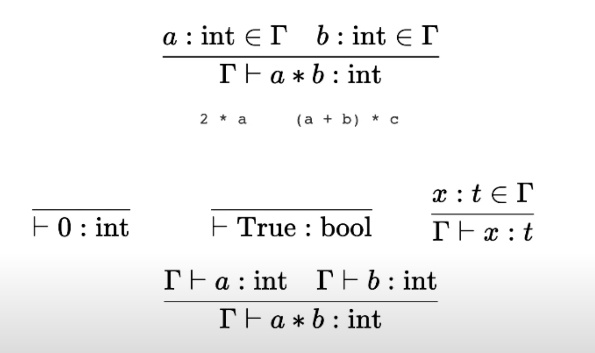 
[Слайд из доклада. Неформальное введение в теорию типов, Максим Кольцов](https://www.youtube.com/watch?v=RzzhKTiDSWQ)

Также прошу принять во внимание, что последние несколько лет автор является фронтенд разработчиком, отсюда в статье будет упоминание JavaScript и это станет его точкой отсчета.

### ООП ∩ Полиморфизм = проблема

Спросите практически любого фронтенд разработчика: «Полиморфизм? Что это такое? Есть ли он в JavaScript?». Готов поспорить, что вы не получите точного и однозначного ответа.

Скорее всего рядовой разработчик ответит вам, что понятия не имеет, что это такое, в то время как ветераны продакшен-действий или наемники, пришедшие во фронтенд из других языков, будут ссылаться на то, что полиморфизм — это один из принципов [ООП](https://ru.wikipedia.org/wiki/%D0%9E%D0%B1%D1%8A%D0%B5%D0%BA%D1%82%D0%BD%D0%BE-%D0%BE%D1%80%D0%B8%D0%B5%D0%BD%D1%82%D0%B8%D1%80%D0%BE%D0%B2%D0%B0%D0%BD%D0%BD%D0%BE%D0%B5_%D0%BF%D1%80%D0%BE%D0%B3%D1%80%D0%B0%D0%BC%D0%BC%D0%B8%D1%80%D0%BE%D0%B2%D0%B0%D0%BD%D0%B8%D0%B5).

Далее они приведут пример, связанный с наследованием, а после ответ вероятно будет подкреплен ссылками на реализацию полиморфизма в других языках программирования, потому что «JavaScript не такой, как все».

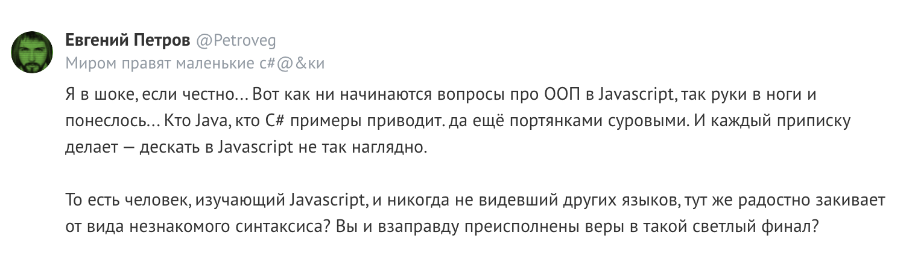[Тостер: Объясните что такое полиморфизм простыми словами?](https://toster.ru/q/119265)

**Безусловно один из принципов ООП — это полиморфизм, но полиморфизм это не только один из принципов ООП.**

Также замечу, что эта постоянная отсылка к ООП создала еще одну проблему: попробуйте уточнить у разработчика понятие полиморфизма без использования или упоминания наследования, и чтобы никаких Cat, Dog, Animal! Ну как? Получилось?

Как подметил [Даня Рогозин](https://twitter.com/p_morphism): на самом деле, есть более общая проблема, что люди очень редко умеют давать точные определения, а сразу идут к примерам по личным ассоциациям.

На YouTube в одном из популярных видео про объяснение принципов ООП нет ничего про полиморфизм, возможно лектору он кажется чем-то естественно вытекающим:


Комментарий к одному из видео на YouTube про объяснение принципов ООП

Большая часть статей, докладов или лекций на тему полиморфизма в других языках программирования, которые мне попадались, описывают исключительно частные виды полиморфизма и, черт возьми, не дают полной картины!

Это похоже на первое правило [бойцовского клуба](https://www.kinopoisk.ru/film/361/): никогда никому не рассказывать о том, что такое полиморфизм. Хотя, на самом деле, про полиморфизм говорят редко, потому что это сложная концепция.

Но преисполнившись верой в светлый финал, я попытался разобраться в этом всём, чтобы поставить точку.

### Πολύμορφος

Дословный перевод с греческого — много форм. И здесь на мой взгляд стоит акцентировать внимание на двух аспектах, которые, применяя к предметной области, позволяют определить наличие полиморфизма, где нечто:

* или принимая различные формы, продолжает сохранять свою суть;
* или одновременно является носителем многих форм.

Например, для кристаллов это возможность самого кристалла находиться в различных типах кристаллических решеток. К слову, углерод может быть представлен как [алмаз](https://ru.wikipedia.org/wiki/%D0%90%D0%BB%D0%BC%D0%B0%D0%B7), [графит](https://ru.wikipedia.org/wiki/%D0%93%D1%80%D0%B0%D1%84%D0%B8%D1%82), [карбин](https://ru.wikipedia.org/wiki/%D0%9A%D0%B0%D1%80%D0%B1%D0%B8%D0%BD) или что-то еще. Но заметьте, что в каком бы то виде ни находилась его кристаллическая решетка, углерод остается углеродом.

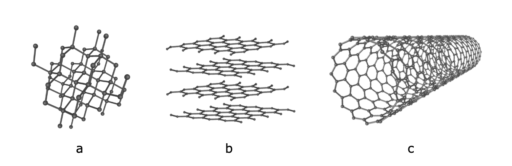 
a — алмаз, b — графит, c — углеродная нанотрубка

Полиморфизм можно также найти в биологии: например, в генетике имеется понятие [аллельных генов](https://ru.wikipedia.org/wiki/%D0%90%D0%BB%D0%BB%D0%B5%D0%BB%D0%B8), или, например, [полиморфизм насекомых](https://ru.wikipedia.org/wiki/%D0%9F%D0%BE%D0%BB%D0%B8%D0%BC%D0%BE%D1%80%D1%84%D0%B8%D0%B7%D0%BC_%D0%BD%D0%B0%D1%81%D0%B5%D0%BA%D0%BE%D0%BC%D1%8B%D1%85), где форма насекомых зависит от принадлежности к конкретной «касте» в улье, сезонности, географии или полу.

В качестве примера для второго аспекта полиморфизма, достаточно обратиться к мифам, сказаниям или легендам, где присутствуют [гибридные существа](https://ru.wikipedia.org/wiki/%D0%93%D0%B8%D0%B1%D1%80%D0%B8%D0%B4%D0%BD%D1%8B%D0%B5_%D1%81%D1%83%D1%89%D0%B5%D1%81%D1%82%D0%B2%D0%B0) являющиеся одновременно комбинацией нескольких, будь то сфинксы, сирены, русалки, минотавры, грифоны, василиски и так далее и тому подобное.

А теперь к делу.

### Полиморфизм

Вся наша деятельность как разработчиков сводится к вычислениям. Логично предположить, что полиморфизм может присутствовать как в вычислениях, так и в описании этих вычислений.

В начале статьи я сетовал на отсутствие полной картины. На самом деле, я вас обманул, имя этой картине — [Теория типов](https://ru.wikipedia.org/wiki/Теория_типов), которая, «неожиданно», изучает типы, используя [методы теории доказательств](https://www.cambridge.org/core/books/type-theory-and-formal-proof/0472640AAD34E045C7F140B46A57A67C)и
аппарат [λ-исчисления](https://ru.wikipedia.org/wiki/%CE%9B-%D0%B8%D1%81%D1%87%D0%B8%D1%81%D0%BB%D0%B5%D0%BD%D0%B8%D0%B5),
но ими не ограничивается.

Понятие «полиморфизм» в программировании тесно связано с типизацией или, если быть более точным, c [системой типов](https://ru.wikipedia.org/wiki/%D0%A1%D0%B8%D1%81%D1%82%D0%B5%D0%BC%D0%B0_%D1%82%D0%B8%D0%BF%D0%BE%D0%B2).

Все то,** что во время компиляции или исполнения программы может содержать или обрабатывать значения различных типов — является полиморфным**, например:

* переменные, меняющие свое значение на значение другого типа;
* объекты, обладающие свойствами, которые могут менять значение текущего типа на значение другого типа;
* функции, принимающие аргументы различных типов.

Но пожалуй, самое лаконичное определение полиморфизма, я нашел в книге Бенджамина Пирса [Типы в языках программирования](https://www.ozon.ru/context/detail/id/7410082/):

> Термин “полиморфизм” обозначает семейство различных механизмов, позволяющих
> использовать один и тот же участок программы с различными типами в различных
контекстах.

Под контекстом, грубо говоря, понимается набор всех доступных переменных в текущем участке программы.

### Полиморфизм. Первое приближение

В 1967 году в мире программирования было зафиксировано первое упоминание о полиморфизме в статье [Fundamental Concepts in Programming Languages](https://www.ics.uci.edu/~jajones/INF102-S18/readings/05_stratchey_1967.pdf) от [Кристофера Стрейчи](https://en.wikipedia.org/wiki/Christopher_Strachey).

На примере языка
[CPL](https://ru.wikipedia.org/wiki/CPL_(%D1%8F%D0%B7%D1%8B%D0%BA_%D0%BF%D1%80%D0%BE%D0%B3%D1%80%D0%B0%D0%BC%D0%BC%D0%B8%D1%80%D0%BE%D0%B2%D0%B0%D0%BD%D0%B8%D1%8F)), автором которого Кристофер и являлся, были показаны некоторые идеи, которые существовали в языках программирования в то время. Кстати, несмотря на публикацию статьи в 1967 году, первый CPL-компилятор был создан лишь в [1970 году](https://blogs.scientificamerican.com/at-scientific-american/systems-analysis-look-back-1966-scientific-american-article/)

В этой статье Кристофер Стрейчи пишет, что в большинстве языков программирования мы используем типы, чтобы понимать, с какими объектами (или переменными) мы имеем дело. Он вводит понятие полиморфных операторов, которые имеют несколько версий (или форм), в зависимости от своих аргументов. Например, то, каким образом необходимо произвести вычисления для оператора +, будет зависеть исключительно от типа операндов.

По итогу Кристофер Стрейчи выделил два основных типа полиморфизма:

* **Параметрический полиморфизм**, который позволяет описывать вычисления в общем виде, абстрагируясь от того, какие типы будут использованы. Проиллюстрирую на примере из [статьи](http://ics.uci.edu/~jajones/INF102-S18/readings/05_stratchey_1967.pdf):

```
Пусть:
    L - список, где все элементы имеют тип α
    f - функция, принимающая аргумент типа α, результат имеет тип β
    map - функция, принимающая функцию-аргумент и список значений,
        результатом является список значений, где к каждому элементу
        исходного списка применяется функция-аргумент

Из описания следует, что типы f и L:
    f: α ⇒ β 
    L: list a

Откуда получаем тип функции map:
    map: (α ⇒ β, list α) ⇒ list β
```

Запись типа *α ⇒ β* означает некое преобразование — функция, которая отображает значения типа α в значение типа β. Запись типа *f: a ⇒ β*, дает имя *f* этой функции. Подобные записи можно объединять в более сложные выражения, как в примере выше *(α ⇒ β, list α) ⇒ list β, *такая запись формирует свой язык над типами.

* **Специальный полиморфизм.** Согласно статье Кристофера Стрейчи в этом виде полиморфизма не существует единого и общего способа определения типа результата по типу аргументов. В нем происходит диспетчеризация (перенаправление) к одной или нескольким функциям для конкретного типа аргумента.

Проиллюстрирую на своем примере, используя воображаемый язык:

```
Пусть:
    typeof - функция, принимающая аргумент любого типа, 
                результат это значение типа String
    multiply - функция, принимающая аргумент value неизвестного типа
                и аргумент multiplier типа Number,
                результатом является произведение аргументов

Из описания typeof следует ее тип:
    typeof: α ⇒ String

Из описания multiply проблематично сделать общее описание
Но можем описать отдельно произведение для строк, чисел и массивов

    multiplyString:  (String, Number) ⇒ String
    multiplyNumber:  (Number, Number) ⇒ Number
    multiplyArray: (Array<T>, Number) ⇒ Array<T>

Тогда функция multiply будет выглядеть так:

fn multiply(value, multiplier):
    switch typeof(value):
    case "string":
        return multiplyString(value, multiplier)
    case "number":
        return multiplyNumber(value, multiplier)
    case "array":
        return multiplyArray(value, multiplier)
    default:
        raise TypeError("Bad type")
```

Выше будем считать что функции *multiplyString*, *multiplyNumber*, *multiplyArray* были реализованы отдельно от примера.

В специальном полиморфизме поведение функции зависит от конкретных типов аргументов, где для каждого типа реализуется свой способ вычислений.

Как правило к специальному полиморфизму относятся арифметические операторы, где происходят неявные приведения типов, и примитивные функции, как функция *multiply* в примере выше.

### Полиморфизм. Второе приближение

Следующей важной статьей касательно полиморфизма является статья [“On Understanding Types, Data Abstraction, and Polymorphism”](http://lucacardelli.name/Papers/OnUnderstanding.A4.pdf), написанная в 1985 году Лука Карделли ([Luca Cardelli](https://en.wikipedia.org/wiki/Luca_Cardelli)) и Питером Вегнером ([Peter Wegner](https://en.wikipedia.org/wiki/Peter_Wegner)), в которой обобщаются виды полиморфизма актуальные на то время:

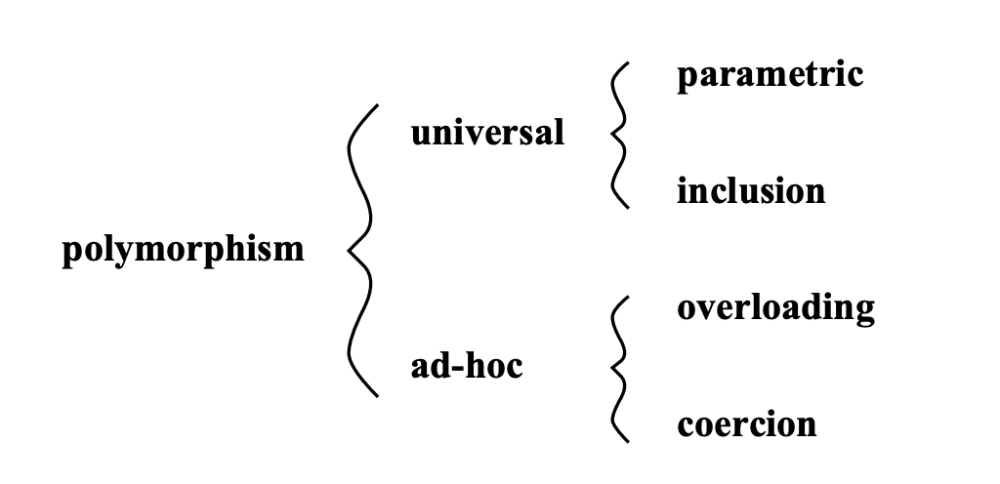
Разновидности полиморфизма в статье Лука Кардели и Питера Вегнера

В статье обозначено две основных категории полиморфизма: *универсальный* (universal) и *специальный* (ad-hoc). К первой категории относят уже знакомый параметрический (parametric) и добавляется полиморфизм включений (inclusion). Во второй категории находится *перегрузка* (overloading) и *приведение типов* (coercion).

Но не смотря на такое разбитие, смысл первоначального деления [Кристофером Стрейчи](https://en.wikipedia.org/wiki/Christopher_Strachey) на две большие группы, так и не поменялся:

* **Универсально полиморфные** функции работают на неограниченном количестве типов, причем функция будет выполняться для любого типа аргументов.
* **Специально полиморфные** функции работают с конечным набором конкретных типов,** **не связанных между собой, где для каждого типа аргументов реализуется свой способ вычислений.

#### **Выдуманный язык SPL**

Давайте придумаем с вами язык SPL (Static Polymorphic Language), который по мере продвижения по статье будет детализироваться, и каждый раз в него будет добавляться поддержка нового вида полиморфизма.

Мы вводим этот язык намеренно, чтобы у нас не было привязки к конкретному языку, а опыт владения этим конкретным языком и знание его особенностей не мешали бы восприятию повествования. Однако это не значит, что мы не будем ссылаться на существующие языки ;)

Пусть язык SPL является очень *строгим* и *статически* типизированным. Если по какой-то причине вам неизвестны, или вы забыли эти понятия, то рекомендую прочитать статью [Ликбез по типизации в языках программирования](https://habr.com/ru/post/161205/) или ознакомится с видео [Типизация / Введение в программирование](https://www.youtube.com/watch?v=1dwJvRw_h7A).

Итак, вот описание возможностей нашего языка:

```
// поддержка комментариев 

42                 // числовой тип данных -  Number
"abc"              // строковый тип данных -  String

a: Number = 42     // или указывается явно
b = "abc"          // или указывается неявно

// операции над числами

4 + 4                   // 8
4 * 4                   // 16
8 / 2                   // 4
8 - 4                   // 4

// операции над строками

"abc" + "xyz"           // "abcxyz" - конкатенация строк

// возможность описывать функции с явным указанием типов

fn sum(a: Number, b: Number) -> Number: 
  return a + b

// встроенные функции в язык

str(100)          // "100", преобразование чисел в строки
print("Hello")    // вывод строк
print(str(100))   // вывод числа приведенного к строке
```

На первое время этих возможностей языка будет более чем достаточно, а при необходимости мы будем расширять наш язык.

Важно иметь в виду, что мы не вдаемся в детали устройства языка. Нас интересует то, как в языке будет проявляться полиморфизм.

#### Сигнатура функции

Также давайте определим такое понятие как сигнатура функции, с которым мы уже успели столкнуться выше, когда знакомились со статьей Кристофера. Под сигнатурой функции мы будем понимать ее имя, аргументы с указанием их типа и тип возвращаемого значения.

Так, для функции sum:

```
fn sum(a: Number, b: Number) -> Number:
  return a + b
```

сигнатура функции в SPL будет следующей:

```
sum(a: Number, b: Number) -> Number
```

Сигнатуры функций между языками программирования могут отличаться. Например, для функции выше, но реализованной на TypeScript, сигнатура будет следующей:

```
function sum(value: number, multiplier: number) : number;
```

Если бы функция была написана на языках похожих на Haskell или Elm, то мы бы получили следующую сигнатуру функции:

```
sum: Int -> Int -> Int
```

Где в этой сигнатуре после последней стрелки описывался бы тип возвращаемого значения суммы.

#### Параметрический полиморфизм

Параметрический полиморфизм — это универсальный вид полиморфизма. Как было сказано ранее, данный вид полиморфизма позволяет описывать вычисления в общем виде. Другими словами, существует возможность описывать функции, которые будут работать с любыми типами данных. Такие функции называют параметрически полиморфными.

Когда мы описываем обычную функцию, мы указываем, какого типа она принимает аргументы, например, S*tring*, *Number*. В случае полиморфных функций мы можем использовать переменные для типов (<T>) вместо настоящих типов, где вместо <T> будет доставлено *String* или *Number*.

Для демонстрации параметрического полиморфизма позаимствуем довольно простую функцию тождества, которая принимает аргумент и возвращает его — все просто. Однако функция *должна работать со всеми типами.*

На нашем языке SPL она будет выглядеть так:

```
fn identity<T>(x: T) -> T:
  return x
```

Где выражение *<T>* будет объявлением переменной типа. Выражение *x: T* показывает какого типа функция принимает аргументы, здесь мы используем переменную типа *Т*, выражение после стрелки показывает какого типа возвращается результат из функции.

Cигнатура функции *identity* в SPL:

```
identity: <T> (x: T) -> T
```

Добавлю, что параметрически полиморфные функции еще также называются обобщенными (Generic), программирование вычислений с помощью таких функций называют [обобщенным программированием](https://ru.wikipedia.org/wiki/%D0%9E%D0%B1%D0%BE%D0%B1%D1%89%D1%91%D0%BD%D0%BD%D0%BE%D0%B5_%D0%BF%D1%80%D0%BE%D0%B3%D1%80%D0%B0%D0%BC%D0%BC%D0%B8%D1%80%D0%BE%D0%B2%D0%B0%D0%BD%D0%B8%D0%B5)(generic programming).

**Лабораторный стол**

Подготовим лабораторный стол с несколькими статически типизированными языками [TypeScript](https://www.typescriptlang.org/), [Elm](https://elm-lang.org/), [C++](https://isocpp.org/) и парой динамических языков [JavaScript](http://www.ecma-international.org/ecma-262/), [Python](https://www.python.org/), далее попытаемся отыскать в каждом из языков тот или иной вид полиморфизма.

Чтобы определить, есть ли в конкретном ЯП тот или иной вид полиморфизма, в идеале необходимо ознакомится с его системой типов. В некоторых из систем типов [полиморфизм формализован](https://repository.brynmawr.edu/cgi/viewcontent.cgi?article=1015&context=compsci_pubs).

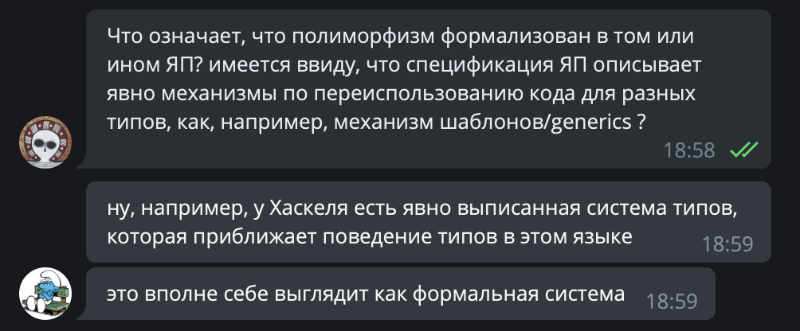Комментарий [Дани Рогозина](http://twitter.com/p_morphism)

Однако я буду использовать *очень наивный подход*: добавив поддержку нового вида полиморфизма в SPL и написав функцию, которая этот полиморфизм поддерживает, мы попробуем реализовать такую же функцию в другом ЯП. Если реализация такой функции невозможна, тогда покажем как конкретный вид полиморфизм может реализовываться по-другому, если он поддерживается в ЯП.

Такой подход позволит только поверхностно исследовать полиморфизм, кстати, чем мы и занимаемся, когда детальное изучение потребует уже совсем другого подхода.

И раз выше речь зашла о параметрическом полиморфизме, то будем использовать функцию *identity* в качестве [лакмусовой бумажки](https://ru.wikipedia.org/wiki/%D0%9B%D0%B0%D0%BA%D0%BC%D1%83%D1%81) для определения поддержки в указанных языках параметрического полиморфизма.

**TypeScript**

В нём есть поддержка [дженериков](https://www.typescriptlang.org/docs/handbook/generics.html), поэтому мы можем описать функцию *identity*, которая будет работать со всеми типами. Для этого воспользуемся переменными типов:

```
function identity <T> (arg: T): T {
    return arg;
}

console.log(identity("Hello !")); // "Hello !"
console.log(identity(42));        // 42
```

**Полные исходники:**[https://bit.ly/example_parametric_polymorphism_typescript](https://bit.ly/example_parametric_polymorphism_typescript)

**Elm**

Язык [Elm](https://elm-lang.org/) поддерживает ограниченный набор концепций из мира функционального программирования. В нем реализация функции *identity* будет выглядеть так:

```
module Main exposing (..)

import Html exposing (text)

identity : a -> a
identity a = a

strings = 
    [ identity "Hello! "
    , String.fromInt (identity 42) ]

main =
    text (String.concat strings) 
```

Где *a* это переменная типа, а сигнатура функции *identity* в Elm:

```
identity : a -> a
```

Кстати мы могли опустить явное описание сигнатуры в коде, компилятор языка вычислил бы ее сам — это называется [вывод типов](https://ru.wikipedia.org/wiki/%D0%92%D1%8B%D0%B2%D0%BE%D0%B4_%D1%82%D0%B8%D0%BF%D0%BE%D0%B2).

**Полные исходники:**[https://bit.ly/example_parametric_polymorphism_elm](https://bit.ly/example_parametric_polymorphism_elm)

Elm поставляет [стандартную библиотек](https://package.elm-lang.org/packages/elm/core/1.0.5/)у, в которой есть набор параметрически полиморфных функций, в том числе и [identity](https://package.elm-lang.org/packages/elm/core/1.0.5/Basics#function-helpers).

К слову, в Haskell реализация функции *identity* аналогична:

```
identity :: a -> a
identity a = a

main :: IO ()
main = do
    print $ identity "hello"
    print $ identity [42]
    print $ identity 42
```

**C++**

C++ поддерживает обобщённое программирование благодаря [шаблонам](https://ru.wikipedia.org/wiki/%D0%A8%D0%B0%D0%B1%D0%BB%D0%BE%D0%BD%D1%8B_C%2B%2B):

```
#include <iostream>
#include <iomanip>

template <typename T> T identity(T x) {
    return x;
}

int main() {
    std::cout << std::boolalpha;
    std::cout << identity(42) << "\n";
    std::cout << identity(true) << "\n";
}
```

**Полные исходники:**[https://bit.ly/example_parametric_polymorphism_cplusplus](https://bit.ly/example_parametric_polymorphism_cplusplus)

**JavaScript (и Python)**

В динамически типизированных языках программирования у переменной нет типа, тип можно получить у значения переменной в конкретный момент времени.

Функцию тождества можно реализовать в JavaScript так:
```
function identity(arg) {
    return arg;
}
```

Благодаря динамической типизации все переменные в JavaScript/Python изначально полиморфны, или, другими словами, могут содержать в себе значения любых типов. Нам не нужно описывать типы аргументов функции или указывать, какой тип имеет переменная.

Однако в контрасте со статически типизированными языками, например, с теми, что были приведены выше, возникают вопросы. Пришлось на время выбежать из лаборатории и обратиться к [профессионалу](https://twitter.com/_bravit):

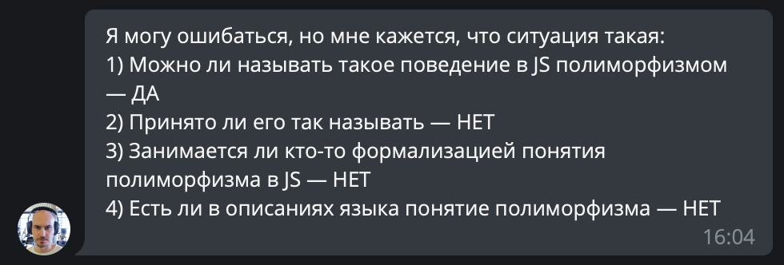
Комментарий [Виталия Брагилевского](https://twitter.com/_bravit)

Об этом также упоминается в учебнике [по теории и практике языков программирования](https://www.piter.com/collection/all/product/teoriya-i-praktika-yazykov-programmirovaniya-uchebnik-dlya-vuzov-2-e-izd-standart-3-go-pokoleniya), где сказано, что в динамически типизированных языках применение параметрического полиморфизма не имеет смысла, так как у переменных нет статически объявляемых типов.

**Параметрический полиморфизм** — **сложная тема**

Формально полиморфизм типов изучается в полиморфно [типизированном лямбда-исчислении](https://ru.wikipedia.org/wiki/%D0%A2%D0%B8%D0%BF%D0%B8%D0%B7%D0%B8%D1%80%D0%BE%D0%B2%D0%B0%D0%BD%D0%BD%D0%BE%D0%B5_%D0%BB%D1%8F%D0%BC%D0%B1%D0%B4%D0%B0-%D0%B8%D1%81%D1%87%D0%B8%D1%81%D0%BB%D0%B5%D0%BD%D0%B8%D0%B5), называемом [Системой F](https://ru.wikipedia.org/wiki/%D0%A1%D0%B8%D1%81%D1%82%D0%B5%D0%BC%D0%B0_F), к которой можно подходить только после изучения обычного [лямбда-исчисления](https://ru.wikipedia.org/wiki/%D0%9B%D1%8F%D0%BC%D0%B1%D0%B4%D0%B0-%D0%B8%D1%81%D1%87%D0%B8%D1%81%D0%BB%D0%B5%D0%BD%D0%B8%D0%B5).

Также, как выяснилось, у [систем типов](https://ru.wikipedia.org/wiki/%D0%A1%D0%B8%D1%81%D1%82%D0%B5%D0%BC%D0%B0_%D1%82%D0%B8%D0%BF%D0%BE%D0%B2), поддерживающих параметрический полиморфизм, существует деление на ранг и предикативность, откуда вытекает деление на дополнительные подвиды полиморфизма.

Стоило только приоткрыть ящик параметрического полиморфизма, как оттуда повалились: пренексный полиморфизм, let-полиморфизм, предикативный полиморфизм, импредикативный полиморфизм. Стало страшно, закрыл!

**В чем польза разработчику?**

Во-первых, как уже было отмечено, мы можем* описывать вычисления в общем виде*. Это полезно при реализации таких алгоритмов, где нам не важно, с чем конкретно мы имеем дело. Например, алгоритму сортировки не важно, что сравнивается в процессе его работы: кошки или собаки, ящерицы или черепашки — ему важно, чтобы эти объекты можно было сравнивать между собой.

Во-вторых, с помощью сигнатур мы *можем получить часть информации о том, что делает та или иная функция*. Возможно, этот момент больше относится к типизации в целом, но параметрический полиморфизм усиливает этот эффект.

Посмотрите, на эту сигнатуру функции из Elm:

```
(a -> Bool) -> List a -> List a
```

Если вы немного подумаете и предположите, что эта сигнатура может принадлежать функции фильтрации, то вы [не ошибетесь](https://package.elm-lang.org/packages/elm/core/latest/List#filter). Однако в языках похожих на Elm, где встроенные библиотеки имеют более богатый функционал, [может найтись и не одна такая функция](https://hoogle.haskell.org/?hoogle=%28a+-%3E+Bool%29+-%3E+List+a+-%3E+List+a&scope=set%3Astackage).

#### Перегрузка

Перегрузка — это разновидность специального полиморфизма. Такой вид полиморфизма позволяет объявлять функции с одним и тем же именем, но с разными типами аргументов и их количеством (арностью). Говоря другими словами, у функции может быть несколько сигнатур.

Или вот цитата, но несколько строже, из [книги](https://www.ozon.ru/context/detail/id/7410082/) Бенджамина Пирса:

> “Самый обычный пример специализированного полиморфизма — перегрузка (overloading), когда один и тот же символ функции соответствует различным реализациям; компилятор (или система времени выполнения, в зависимости от того, идет ли речь о статическом (static) или динамическом (dynamic) разрешении перегрузки) выбирает подходящую реализацию для каждого случая применения функции, исходя из типов ее аргументов.”

Добавим возможность перегрузки функций в SPL. Напишем функцию умножения, которая сможет умножать не только числа, но и строки. Умножение строк будет заключаться в повторении переданной строки указанное количество раз:

```
fn multiply(value: String, multiplier: Number) -> String:
  result = ""
  for i to multiplier:
    result += value
  return result

fn multiply(value: Number, multiplier: Number) -> Number:
  return value * multiplier

multiply("Hello! ", 3) // "Hello! Hello! Hello! "
multiply(42, 3)        // 126
```

Откуда функция *multiply* имеет две сигнатуры:

```
multiply: (value: String, multiplier: Number) -> String
multiply: (value: Number, multiplier: Number) -> Number
```

Во время вызова функции *multiply* компилятор сам определит необходимую версию функции (диспетчеризация) на основе типов аргументов.

Важно отметить, что мы указываем конкретные типы и не описываем реализацию в общем виде, реализация для каждого набора типов своя. Еще говорят, что мы описываем множество мономорфных функций.

Добавлю, что в других языках программирования, поддерживающих перегрузку, помимо функций, перегруженными могут быть методы классов или операторы для работы с конкретными типами.

**Лабораторный стол**

В качестве лакмусовой бумаги на этот раз мы будем использовать вышеописанную функцию *multiply* для каждой пробирки со своим языком программирования.

**TypeScript**

Если попытаться описать перегрузку в TypeScript таким же образом, как для SPL, то ни к чему хорошему это не приведет:

```
function multiply(value: string, multiplier: number) : string {
    return value.repeat(multiplier);
}

function multiply(value: number, multiplier: number) : number {
    return value * multiplier;
}
```

После попытки скомпилировать код получим ошибку:

```
Duplicate function implementation.
```

Перегрузка в TypeScript допустима, но [реализуется по-другому](https://www.typescriptlang.org/docs/handbook/declaration-files/do-s-and-don-ts.html#function-overloads):

```
type Value = string | number

function multiply(value: string, multiplier: number) : string;
function multiply(value: number, multiplier: number) : number;

function multiply(value: Value, multiplier: number) : Value {
  if (typeof value == "string") {
    return value.repeat(multiplier)
  }

  return value * multiplier;
}
```

**Полные исходники:** [bit.ly/example_overloading_polymorphism_typescript](https://bit.ly/example_overloading_polymorphism_typescript)

Функция *multiply* должна быть полностью совместима со всеми перегруженными сигнатурами, именно поэтому выше мы добавили [union тип](https://www.typescriptlang.org/docs/handbook/advanced-types.html#union-types) *Value* для аргумента функции valuе и возвращаемого значения.

**Elm**

При попытке скомпилировать текущий код:

```
module Main exposing (..)

import Html exposing (text)

multiply : String -> Int -> String
multiply x y = String.repeat x y

multiply : Int -> Int -> Int
multiply x y = x * y

main =
  text (String.fromInt (multiply 5 5))
```

В примере выше, даже нет Мы получим следующую ошибку:

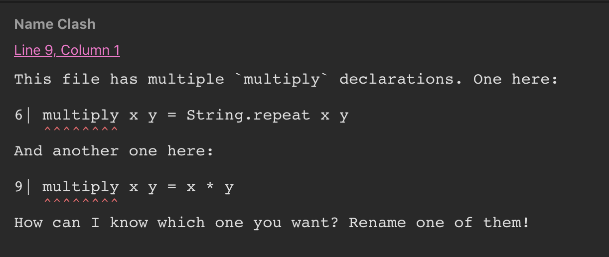

У каждой описываемой функции может быть только одна сигнатура. Если попытаться объявить функцию с таким же именем произойдет конфликт имен. Elm не поддерживает перегрузку.

**Полные исходники:** [bit.ly/example_overloading_polymorphism_elm](http://bit.ly/example_overloading_polymorphism_elm)

**C++**

В C++ существует возможность перегружать функции:

```
#include <vector>
#include <cstdint>
#include <string>
#include <iostream>

std::string multiply(const std::string& value, size_t times ) {
    std::string result = "";
    result.reserve(value.length() * times);
    for (size_t i = 0; i < times; ++i){
        result += value;
    }
    return result;
}

int multiply(int value, int multiplier) {
    return value * multiplier;
}

int main() {
    std::cout << multiply(6, 5) << "\n";       // 30
    std::cout << multiply("hello", 3) << "\n"; // "hellohellohello"
}
```

**Полные исходники:** [bit.ly/example_overloading_polymorphism_cplusplus](http://bit.ly/example_overloading_polymorphism_cplusplus)

Также в C++ можно перегружать операторы, методы классов, и порой кажется, что в нем можно делать вообще все.

**Python**

По счастливой случайности в Python оператор умножения уже перегружен, то есть он может умножать числа и строки, причем так, как мы описали это выше. Поэтому писать вторую функцию *multiply* конкретно в данном случае не придется:

```
def multiply(a, b):
    return a * b

multiply("a", 5)  # "aaaa"
multiply(5, 5)    # 25
```

**Полные исходники примера:** [bit.ly/example_overloading_polymorphism_python__1](https://bit.ly/example_overloading_polymorphism_python__1)

В Python существует [возможность перегружать операторы классов](https://docs.python.org/3/reference/datamodel.html#basic-customization). Например, вот так мы легко мы можем описать класс “капля воды”, где одна капля может присоединяться к другой и существует возможность сравнивать капли:

```
class WaterDrop:
    def __init__(self, size):
    self.size = size
    
    def __add__(self, other):      # перегрузка оператора суммы
    self.size += other.size
    return self

    def __str__(self):
    return f'Size is {self.size}'

    def __eq__(self, other):       # перегрузка оператора сравнения
    return self.size == other.size

one_small_drop = WaterDrop(3)
other_small_drop = WaterDrop(3)
big_drop = WaterDrop(10)

print(big_drop + one_small_drop + other_small_drop) # Size is 16
print(one_small_drop == other_small_drop)           # True
```

**Полные исходники примера:** [bit.ly/example_overloading_polymorphism_python__2](http://bit.ly/example_overloading_polymorphism_python__2)

Но вернемся к нашей “лакмусовой бумажке”. Если написать несколько функций *multiply*, то каждая следующая перезапишет ранее объявленную функцию, и даже [type hints](https://docs.python.org/3/library/typing.html) тут нам не помогут:

```
def multiply(value: int, multiplier: int) -> int:
    return value * multiplier

def multiply(value: str, multiplier: int) -> str:
    result = ""
    for _ in range(multiplier):
    result += value
    return result

print(multiply("a", 5))    # "aaaaa"
print(multiply(5, 5))      # ?
```

Более того, при выполнении функции *multiply(5, 5)* возникнет ошибка:

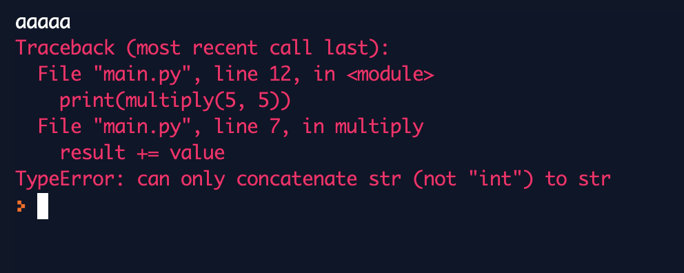

**Полные исходники примера :**
[bit.ly/example_overloading_polymorphism_example_3](https://bit.ly/example_overloading_polymorphism_python__3)

**JavaScript**

JavaScript также не поддерживает перегрузку функций в том виде, как это было определено выше в SPL:

```
function multiply(value, multiplier) {
    return value.repeat(multiplier);
}

function multiply(value, multiplier) {
    return value * multiplier
}
```

При попытке повторно объявить функцию с таким же именем через [Function Declaration](https://developer.mozilla.org/en-US/docs/Web/JavaScript/Reference/Statements/function), мы перезапишем ранее объявленную функцию.

**Ручная диспетчеризация**

В определении перегрузки было сказано, что компилятор занимается тем, что решает, какой вариант функции использовать в зависимости от типов аргументов. Однако этим может заниматься разработчик, например, в JavaScript:

```
function multiply(value, multiplier) {
    if (typeof multiplier !== "number") {
        throw new TypeError('Bad type of multiplier')
    }

    if (typeof value === "number") {
        return value * multiplier
    }

    if (typeof value === "string") {
        return value.repeat(multiplier)
    }

    throw new TypeError('Bad type of value')
}
```

В Python же кстати, чтобы не писать подобное множество if-ов, существует сторонняя библиотека для множественной [диспетчеризации](https://pypi.org/project/multimethod/).

Из этого всего попытка использовать формальное определение и функцию *multiply* в качестве лакмусовой бумажки для определения перегрузки, как специального вида полиморфизма, вызывает вопросы.


Комментарий [Виталия Брагилевского](https://twitter.com/_bravit)

**В чем польза от перегрузки для разработчика?**

Вернемся к примеру с сортировкой, где описывается алгоритм сортировки в общем виде. В нём мы упомянули оператор сравнения. В случае, если ЯП поддерживает перегрузку функций, то мы можем описать функцию сравнения для каждого типа.

Расширим наш язык SPL:

```
true,  false               // тип данных Boolean

[1, 2, 3]                  // списочный тип данных List <T>
['a', 'b', 'c']
['a', 'b', 'c']

if true:                   // выражение условия
    print('condition')     // тело условия

len([1, 2, 3])             // получение длины списка
```

Теперь напишем алгоритм сортировки списка пузырьком на SPL:

```
fn isGreater(a: Char, b: Char) -> Boolean:
  return toCode(a) > toCode(b)

fn isGreater(a: Number, b: Number) -> Boolean:
  return a > b

fn isGreater(a: Boolean, b: Boolean) -> Boolean:
  return a

fn swap<T>(list: List<T>, i: number, j: Number) -> List<T>:
  tmp = list[j]
  list[j] = list[i]
  list[i] = tmp
  return list

fn bubbleSort<T>(list: List<T>) -> List<T>:
  n = len(list)
  for i = 0 to n-1:
    for j = 0 to n-i-1:
      if isGreater(list[j], list[j+1]):
        list = swap(list, j, i)
  return list

bubbleSort([4, 3, 2])                  // [2, 3, 4]
bubbleSort([true, false, false, true]) // [false, false, true]
bubbleSort(["c", "b", "a"])            // ["a", "b", "c"]
```

В реализации сортировки списка пузырьком выше, за счет параметрического полиморфизма мы описали функции *swap* и *bubbleSort*, а благодаря перегрузке функций реализовали функцию сравнения *isGreater* для типов *Char*, *Number*, *Boolean*.

Таким образом комбинация параметрического полиморфизма и перегрузок позволит писать меньше кода для различных типов.

#### Подтипирование

Очевидно что системы типов в языках программирования могут отличаться между собой, поэтому и системы подтипирования также могут отличаться.

Существует два подхода к классификации того, на основе чего может быть реализована системы подтипизации:

* реализация на включениях (*inclusive*), в которой любое значение типа A представляет такое же значение, но типа B, если А — подтип B. Например, в ОО языках подтипирование основано, как правило, на включениях (*inclusive*).
* реализация на приведении (*coercive*), где любое значение типа A может автоматически быть сконвертировано в значение типа B. Отношения подтипов, которые связывают целые числа и числа с плавающей точкой, обычно основаны на приведениях (*coercive*).

Возможность определять подтипы в ЯП потенциально может привести нас еще к одному виду полиморфизма, полиморфизму включений.

#### Полиморфизм включений

Полиморфизм включений — это универсальный вид полиморфизма (согласно статье Лука Карделли и Питера Вегнера). В этом виде полиморфизма функции или операторы [могут содержать один или множество аргументов, типы которых имеют подтипы](https://westmont.edu/~iba/teaching/CS105/CS105-S04/lecturenotes/Ch08.pdf).

В самом общем смысле, тип — это множество значений, поэтому классы в ООП можно рассматривать как тип, потому что они порождают множество значений.

Расширим наш язык SPL и превратим его в ОО язык, добавив поддержку классов, а именно возможность наследовать классы, и возможность переопределять методы.

```
class Animal:                   // объявление класса
    fn say():                   // объявление метода say
    print('..')

class Dog extends Animal:       // расширение класса (наследование)
    fn say():                    
    print('wauf ')

class Cat extends Animal:
    fn say():
    print('meow ')

animal = Animal()               // создание экземпляров класса
cat = Cat()
dog = Dog()

animals: List<Animal> = [animal, cat, dog]
```

Это классический пример наследования, где мы создаем класс Animal, затем расширяем его классами Dog и Cat, в которых переопределяем метод say.

Напишем функцию, которая заставит список животных говорить:

```
fn sayAnimals(animals: List<Animal>):
  print('animals say: ')
  for animal in animals:
    animal.say()

sayAnimals([ Dog(), Dog() ])   // animals say: wauf wauf 
sayAnimals([ Cat(), Dog() ])   // animals say: meow wauf
sayAnimals([ Cat(), Cat() ])   // animals say: meow meow
```

Данная функция по определению выше является полиморфной. Поскольку нет ограничений на количество подтипов, то с помощью этого полиморфизма мы можем описать вычисления не только для конкретного типа, но для и всех его возможных подтипов.

Как правило все ОО языки, основанные на классах, например Java, C#, TypeScript, и прочие поддерживают данный тип полиморфизма.

Полиморфизм включений в объектно-ориентированных языках отражает [принцип подстановки Барбары Лисков](https://ru.wikipedia.org/wiki/%D0%9F%D1%80%D0%B8%D0%BD%D1%86%D0%B8%D0%BF_%D0%BF%D0%BE%D0%B4%D1%81%D1%82%D0%B0%D0%BD%D0%BE%D0%B2%D0%BA%D0%B8_%D0%91%D0%B0%D1%80%D0%B1%D0%B0%D1%80%D1%8B_%D0%9B%D0%B8%D1%81%D0%BA%D0%BE%D0%B2)(вспомните принципы [SOLID](https://ru.wikipedia.org/wiki/SOLID_(%D0%BE%D0%B1%D1%8A%D0%B5%D0%BA%D1%82%D0%BD%D0%BE-%D0%BE%D1%80%D0%B8%D0%B5%D0%BD%D1%82%D0%B8%D1%80%D0%BE%D0%B2%D0%B0%D0%BD%D0%BD%D0%BE%D0%B5_%D0%BF%D1%80%D0%BE%D0%B3%D1%80%D0%B0%D0%BC%D0%BC%D0%B8%D1%80%D0%BE%D0%B2%D0%B0%D0%BD%D0%B8%D0%B5))), о чем она подробно написала в 1987 году в своей статье [Data Abstraction and Hierarchy](https://klevas.mif.vu.lt/~plukas/resources/OODPrinciples/Liskov1987.pdf). Или наоборот: принцип гарантирует полиморфизм включений.

Принцип Барбары Лисков [звучит так:](https://ota-solid.now.sh/lsp)

> Функции, которые используют базовый тип, должны иметь возможность использовать
> подтипы базового типа, не зная об этом.

Может показаться, что эта формулировка и есть полиморфизм, однако полиморфизм включений обеспечивается не только возможностью функции работать со всеми подтипами, но и переопределением методов в наследуемых классах. То есть в одном из подклассов может быть определена собственная версия метода с тем же именем, эта версия может уточнять или замещать предыдущую версию.

Или, говоря другими словами, для данного вида полиморфизма язык также должен поддерживать подтипизацию, а именно давать разработчику возможность создавать подтипы (дочерние классы) для конкретного типа (класса), одновременно с возможностью принимать этот тип и все его подтипы в качестве аргумента функции или метода.

Кстати, когда описывают полиморфизм в ООП, то говорят, что полиморфизм — это комбинация возможностей наследования классов и переопределения метода в дочернем классе.

Если бы вымышленный язык SPL поддерживал интерфейсы, то мы могли бы рассматривать не только классы как типы, но и интерфейсы как типы. Этот момент хочется прокомментировать цитатой из учебника [Теория и практика языков программирования](https://www.chitai-gorod.ru/catalog/book/992686/):

> Очень интересной особенностью интерфейсов является то, что они обеспечивают некоторую разновидность полиморфизма. Суть в том, что интерфейсы могут трактоваться как типы. К примеру, некоторый формальный параметр метода определяется как интерфейс. Такому формальному параметру соответствует фактический параметр любого класса, который реализует интерфейс. Следовательно, метод становится полиморфным.

**C++**

Позволяется писать программы в ООП-стиле:

```
#include <cstdio>
#include <iostream>
#include <memory>
#include <vector>

class Animal {
    public:
    
    // polymorhic objects should have virtual destructor to
    // prevent UB on deletion through pointers to base-class
    
    virtual ~Animal() = default;

virtual void say() {
        std::cout << "..";
    }
};

class Cat : public Animal {
    public:
    
    // 'override' is not required. It enforces compile-time check
    void say() override {
        std::cout << "meow";
    }
};

class Dog : public Animal {
    public:
        void say() override {
        std::cout << "wouf";
        }
};

using AnimalPtr = std::unique_ptr<Animal>;

void SayAnimals(const std::vector<AnimalPtr>& animals) {
    for (auto& animal : animals) {
    animal->say();
    std::cout << "\n";
    }
}

int main() {
    const auto animals = []{ 
        // vector of unique_ptrs can't be initialized 
        // from initializer_list
        // due to unique_ptr has not copy-constructor
    
        std::vector<AnimalPtr> animals;

        animals.emplace_back(std::make_unique<Cat>());
        animals.emplace_back(std::make_unique<Dog>());
        animals.emplace_back(std::make_unique<Animal>()); 
    
        return animals;
    }();
    
    SayAnimals(animals);
}
```

**Полные исходники:** [bit.ly/example_inclusion_polymorphism_cplusplus](https://bit.ly/example_inclusion_polymorphism_cplusplus)

Другие реализации:

* [https://godbolt.org/z/JnpG8U](https://godbolt.org/z/JnpG8U)
* [https://godbolt.org/z/R7U6W-](https://godbolt.org/z/R7U6W-)

**Elm**

Не поддерживает ОО парадигму, в языке нет возможности описывать подтипы, отсюда нет поддержки полиморфизма включений.

#### Полиморфизм или нет: TypeScript vs TypeScript

В отличие от общеизвестных ОО языков типа C++ или Java понятия подтипизации и наследования в других языках могут быть несвязанными концепциями. Это можно увидеть в [OCaml](https://caml.inria.fr/pub/docs/oreilly-book/html/book-ora144.html) или, например, в TypeScript:

```
class A {
    prop: number
    constructor(prop: number) {
    this.prop = prop
    }
}

class AA extends A {}

class B {
    prop: number
    constructor(prop: number) {
    this.prop = prop
    }
}

class BB extends B {}

function output(objects: A[]) {
    objects.forEach((object: A) => {
    console.log(obj.prop)
    })
}

// 1

const a:A = new A(1)
const b:B = new B(2)

output([a, a, a, a]) 
output([a, a, b, b]) 

// 2

const aa:AA = new AA(1)
const bb:BB = new BB(2)

output([aa, aa, aa, aa])
output([aa, aa, bb, bb])
```

По определению функция *output* является полиморфной, поскольку способна обрабатывать значения типа A и всего подтипы, но будет ли этот полиморфизм проявляться в первом и во втором блоке кода? То есть будет ли функция *output* работать с подтипами типа A в каждом блоке кода?

Ответ на этот вопрос лежит в понятии [структурной типизации](https://en.wikipedia.org/wiki/Structural_type_system), которая поддерживается в TypeScript и OCaml. При структурной типизации два типа данных считаются эквивалентными, если они имеют идентичную структуру, т.е. для каждого метода или атрибута одного типа существуют идентичные методы и атрибуты в другом типе, и наоборот.

Отсюда типы A и B считаются эквивалентными типами, поэтому в первом блоке кода функция *output* работает с одним и тем же типом. То есть никакой речи о подтипах в этом случае не идет.

Во втором блоке кода значения aa и bb являются подтипами типа A и B и используются в качестве аргументов для функции *output*. В этом случае, учитывая что тип B эквивалентен типу A, функция обрабатывает массив значений подтипов типа A.

#### Полиморфизм или нет: TypeScript vs JavaScript

Давайте перепишем наш пример с наследованием на TypeScript и JavaScript и сравним реализации.

**TypeScript**

Код ниже демонстрирует полиморфизм включений. Функция *sayAnimals* может работать с типом Animal и всеми его подтипами, где в аргументах функции *sayAnimals* это описывается явным образом.

```
class Animal {
    say() {
    console.log('..')
    }
}

class Cat extends Animal {
    say() {
    console.log('meow')
    }
}

class Dog extends Animal {
    say() {
    console.log('wouf')
    }
}

const animals = [new Cat(), new Dog(), new Animal()]

function sayAnimals(animals: Animal[]) {
    animals.forEach(animal => animal.say())
}

sayAnimals(animals)
```

**JavaScript**

Если написать подобный пример кода на JavaScript, который отличается только объявлением типа *animals* в функции *sayAnimal*:

```
class Animal {
    say() {
    console.log('..')
    }
}

class Cat extends Animal {
    say() {
    console.log('meow')
    }
}

class Dog extends Animal {
    say() {
    console.log('wouf')
    }
}

const animals = [new Cat(), new Dog(), new Animal()]

function sayAnimals(animals) {
    animals.forEach(animal => animal.say())
}

sayAnimals(animals)
```

или даже если убрать расширение класса *Animal*:

```
class Animal {
    say() {
    console.log('..')
    }
}

class Cat {
    say() {
    console.log('meow')
    }
}

class Dog {
    say() {
    console.log('wouf')
    }
}

const animals = [new Cat(), new Dog(), new Animal()]

function sayAnimals(animals) {
    animals.forEach(animal => animal.say())
}

sayAnimals(animals)
```

то функция *sayAnimals* успешно обработает все входящие аргументы, не только предполагаемый нами «тип» Animal и всего его подтипы, но и вообще все значения любых типов в силу динамической природы языка.

Функция ожидает, что любой объект, который будет передан в качестве аргумента «умеет говорить», то есть имеет метод *say*, это, кстати, называется утиной типизацией. **Утиная типизация не является полиморфизмом**.

Почему [утиная типизация](https://ru.wikipedia.org/wiki/%D0%A3%D1%82%D0%B8%D0%BD%D0%B0%D1%8F_%D1%82%D0%B8%D0%BF%D0%B8%D0%B7%D0%B0%D1%86%D0%B8%D1%8F) не является полиморфизмом?** **Утиная типизация присуща динамически типизированным языкам. Это неявная типизация, в которой типы не определяются на уровне синтаксиса. С точки зрения утиной типизации, если два объекта имеют одинаковое поведение, то они относятся к одному типу, например:

```
const obj1 = { 
    myMethod: () => console.log('hello'),
    propA: 'value' 
}

const obj2 = {
    myMethod: () => console.log('hellohello')
    propB: 'value'
}

const callMethod = obj => obj.myMethod()

callMethod(obj1)
callMethod(obj1)
```

В коде выше для функции *callMethod *объекты *obj1* и *obj2* — это объекты относящиеся к одному типу, поскольку обладают похожим поведением, имеют метод *myMethod*. Когда мы говорим, что функция *callMethod* полиморфна, то имеем в виду, что функция способна обрабатывать значения разных типов, но в текущей ситуации тип всего один.

Вернемся к JavaScript.

Чтобы реализация функции *sayAnimals* на JavaScript начала попадать под определение полиморфизма включений, функция должна обрабатывать тип *Animal* и всего его подтипы, ни больше, ни меньше.


Теперь мы можем заявить, что функция *sayAnimal* является полиморфной с точки зрения полиморфизма включений:

```
function sayAnimals(animals) {
    animals.forEach(animal => {
    if (animal instanceof Animal) {
        animal.say()
    }
    })
}
```

Как и в случае со специальным полиморфизмом в JavaScript, здесь мы занимаемся ручной проверкой типов, а именно: проверяем то, что элемент списка есть подтип или тип *Animal*.

#### Встроенные полиморфные функции и переменные

Практически в любом языке присутствуют функции, у которых может быть несколько сигнатур. Также в языках могут присутствовать функции, которые могут работать со всеми типами языка.Также в язык могут быть встроены классы или объекты, где методы обладают подобными свойствами.

Другими словами, в языке могут присутствовать полиморфные функции или переменные.

В стандартной библиотеке Elm есть много разных полиморфных функций, например:

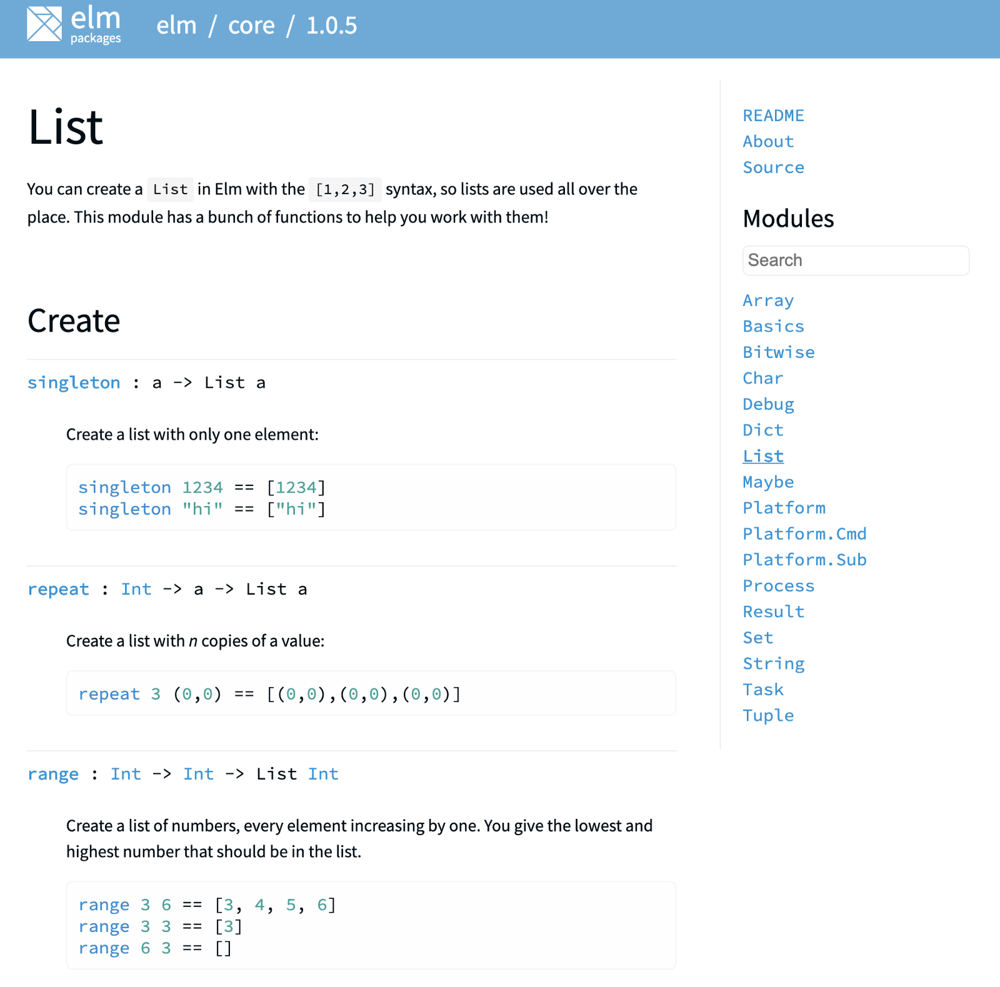
[Core Elm Library. Список модулей](https://package.elm-lang.org/packages/elm/core/latest/List)

Или, например, переменная [this в TypeScript является полиморфной](https://www.typescriptlang.org/docs/handbook/advanced-types.html#polymorphic-this-types) внутри методов классов, поскольку this может ссылаться не только на текущий экземпляр класса, но и на экземпляр подкласса.

#### Приведение типов

Приведение типов — это специальный вид полиморфизма. Возьмем два динамически типизированных языка: JavaScript и Python. Попробуем сложить строку и число (значения разных типов).

Сначала попробуем это сделать в Python:

```
>>> "Answer is " + 42
Traceback (most recent call last):
  File "<stdin>", line 1, in <module>
TypeError: can only concatenate str (not "int") to str
```

Python является строго типизированным языком, поэтому перед тем как выполнить любую операцию над значениями разных типов необходимо явно преобразовать значения к одному типу:

```
>>> "Answer is " + str(42)
'Answer is 42'
```

Операции над значениями различных типов в JavaScript происходят по принципу «Спасибо! Дальше я сам»:

```
> "answer is " + 42
'answer is 42'
```

Здесь происходит неявное преобразование типа второго аргумента к типу первого аргумента, и, на первый взгляд, это может показаться удобным, однако в JavaScript складывать можно массивы с булевыми значениями, объекты с числами, в общем, что угодно с чем угодно.

Из примеров выше логично сделать вывод, что *приведение типов может быть явным (casting) и неявным (coercion)*. К слову, в JavaScript можно приводить и явным способом значения к указанному типу:

```
> "answer is " + String(42)
'answer is 42'
```

*Неявное приведение типов является подтипом специального полиморфизма.*

Из примера выше, где я сравнил сильный Python и слабый JavaScript, может показаться, что неявное приведение типов возможно только в слабо типизированных языках, но это не так.

При сложении целого числа и числа с плавающей точкой целочисленный операнд преобразуется в число с плавающей точкой в большинстве известных мне ЯП, вне зависимости от того, слабо или сильно он типизирован.

Но могут быть исключения. Например, ReasonML или OCaml требуют явного привидения чисел к типу *Float*, а складывать значения типа *Float* необходимо, используя [специальные арифметических операторы с точкой в конце](https://reasonml.github.io/docs/en/integer-and-float#usage-1).

Языки могут поддерживать различное приведение типов в различных контекстах, например, во время присваивания значений, при выполнении разных бинарных или унарных операций, при использовании переменных в качестве аргументов функций и так далее.

Когда язык поддерживает неявное приведение типов аргументов при вызове функции, тогда функция, которая занимается приведением, считается полиморфной.

**Почему неявное приведение типов это полиморфизм?**

Добавим в наш вымышленный язык SPL неявное приведение типов. Для этого разделим тип *Number* (все числа) на два: тип *Int* (целочисленные значения) и тип *Float* (целочисленные значения + числа с плавающей точкой):

```
-2.0 -1.0, 0.0, 1.0, 2.0  // Float
-2 -1, 0, 1, 2            // Int 
```

Добавим правило. Если в операциях над числами одновременно встречаются и *Int*, и *Float*, или если функция ожидает аргумент типа *Float*, а передается значение  типа *Int*, то пусть значение типа *Int* будет неявно приведено к типу *Float*, то есть:

```
fn sum(a: Float, b: Float) -> Float:
    return a + b 

sum(1, 2)       // 3.0
sum(1.0, 2)     // 3.0
sum(1, 2.0)     // 3.0
sum(1.0, 2.0)   // 3.0
```

В этом примере функция sum, может обрабатывать 4 комбинации пар типов, то есть в рамках конкретных типов, у нас происходит переиспользование одного и того же участка кода, что по нашему первому определению из [книги Пирса](https://www.ozon.ru/context/detail/id/7410082/) есть полиморфизм.

Между неявным приведением и перегрузкой могут возникать неочевидные или даже конфликтные ситуации, например:

```
abs(5.5) == 5;        // abs в C принимает int

std::abs(5.5) == 5.5; // abs в C++ abs нормально перегружен
```

**Лабораторный стол**

Давайте в качестве лакмусовой бумаги возьмём выражение “1.0 + 2”. Такой подход, как мы выяснили ранее, иногда даёт сбои, но иногда срабатывает. Пусть в выражении значение 2 имеет один тип, а значение 1.0 имеет тип шире. Результирующие значение пусть имеет такой же тип как и 1.0, то есть 2 будет неявно приведено к тому же типу, что и 1.0.

**Elm**

Результаты в elm repl:

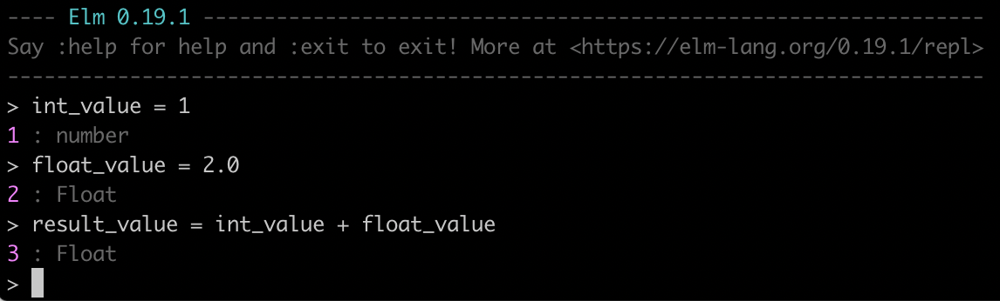

**C++**

```
#include <iostream>
#include <typeinfo>

int main() {
    float float_value = 1;
    int int_value = 2;

    // int_value приведется к типу float
    std::cout << typeid(long_value + int_value).name() << "\n";
}
```

**Python**

Результат в repl

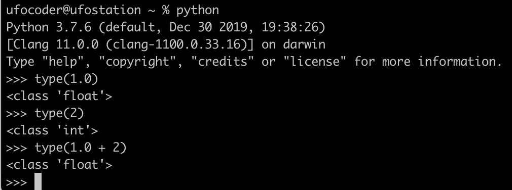

**TypeScript/JavaScript**

Новая лакмусовая бумага здесь не работает, потому что целочисленное значение и значение с плавающей точкой принадлежат одному и тому же типу *number*:

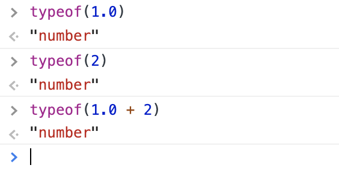

Однако в этих языках существует неявное приведение типов:

```
console.log(argument)       // argument приведется к типу String
if (expression) { /* */ }   // expression приведется к типу Boolean
[1, 2, 3] + "abc"           // массив приведется к типу String
```

Это означает, что не важно, находятся ли приводимые типы в отношении подтипизации (то есть когда один тип является подтипом другого), приведение типов может производиться между значениями любых типов.

Стоит дополнить, что в JavaScript существует возможность управлять тем, как именно будет приведен указанный объект к примитивному типу с помощью [Symbol.toPrimitive](https://developer.mozilla.org/ru/docs/Web/JavaScript/Reference/Global_Objects/Symbol/toPrimitive).

#### Расширение и сужение типов

Неявно приводимые типы могут находиться в отношении подтипизации. Например, в C++ отношение подтипизации для численных типов выглядит следующим образом:

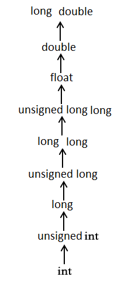[C type casting](https://www.tes.com/lessons/W5eZ5Zxlz5LHNw/cs201-l14-type-conversion)

Из этой иерархии логично предположить, что неявное приведение типов может происходить как в сторону расширения типов — движение вверх по иерархии на схеме выше, так и в сторону сужения типов — движение вниз по иерархии на схеме выше.

Расширение типов при неявном приведении может происходить внутри математических выражений, в таком случае типы расширяются в сторону «наибольшего»:

```
#include <iostream>
#include <typeinfo>

int main() {
    double double_value = 1;
    float float_value = 1;
    long long_value = 1;
    int int_value = 1;

    // приведение к типу double
    std::cout << typeid(double_value + float_value).name() << "\n";
    std::cout << typeid(double_value + long_value).name() << "\n";
    std::cout << typeid(double_value + int_value).name() << "\n";

    // приведение к типу float
    std::cout << typeid(float_value + long_value).name() << "\n";
    std::cout << typeid(float_value + int_value).name() << "\n";

    // приведение к типу long
    std::cout << typeid(long_value + int_value).name() << "\n";
}
```

**Рабочий пример:** [bit.ly/example_widening_coercion_polymorphism_cplusplus](https://bit.ly/example_widening_coercion_polymorphism_cplusplus)

А что насчет сужения?

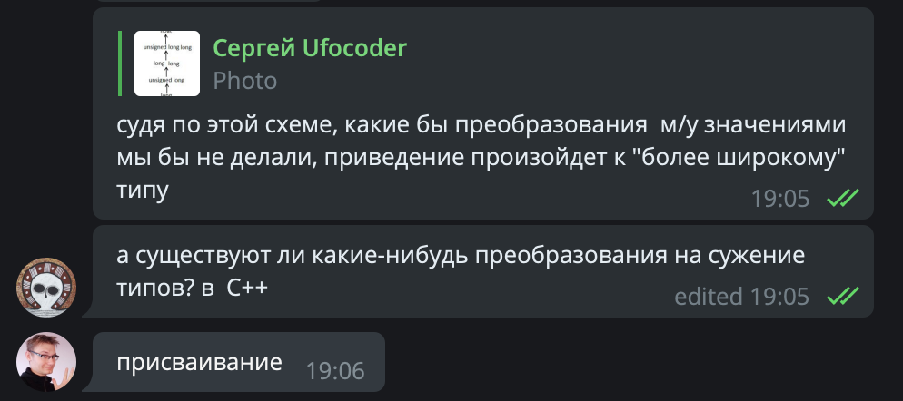
Комментарий [Дмитрия Свиридкина](https://twitter.com/Nekrolm/)

```
#include <iostream>
#include <typeinfo>

int main() {
    double double_value = 1;
    float float_value = 1 + double_value;
    long long_value = 1 + float_value;
    int int_value = 1 + long_value;

    std::cout << typeid(float_value).name() << "\n"; // float
    std::cout << typeid(long_value).name() << "\n";  // long
    std::cout << typeid(int_value).name() << "\n";   // int
}
```

**Рабочий пример:** [bit.ly/example_narrowing_coercion_polymorphism_cplusplus](https://bit.ly/example_narrowing_coercion_polymorphism_cplusplus)**t**

#### Лабораторные результаты и общие выводы

Полиморфизм в программировании — это возможность использования одного и того же кода с разными типами аргументов и переменных. Практическая польза в полиморфизме для разработчика — частичное сокращение [бойлерплейт кода](https://en.wikipedia.org/wiki/Boilerplate_code).

Существует две основные категории полиморфизма: универсальный и специальный, где последний работает на ограниченном множестве типов. В каждой категории есть свои подвиды, и у каждого подвида есть свои особенности:


Разновидности полиморфизма в [статье Лука Кардели и Питера Вегнера](http://lucacardelli.name/Papers/OnUnderstanding.A4.pdf)

Полиморфизм в конкретном языке или его отсутствие во многом определяется его системой типов. Взяв несколько статически и динамически типизированных языков программирования, *используя наивный подход*, и применяя к ним существующие определения, мы выявили наличие в них того или иного вида полиморфизма:

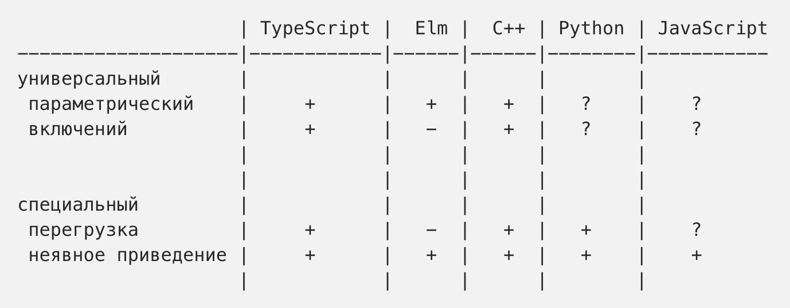

Получившийся результат *местами условный* — сложность в определении вызывают динамически типизированные языки. Они своим поведением напоминают параметрический полиморфизм, однако понятие параметрического полиморфизма в них не формализовано. Плюс присутствующую в них утиную типизацию не интересуют являются ли аргументы функций подтипом конкретного типа, ей важно, чтобы объекты обладали схожим поведением — отсюда сложности в определение полиморфизма включений.

Язык может предлагать свои механизмы для реализации полиморфизма, например, шаблоны в C++ или дженерики в TypeScript. Или полиморфизм может быть реализован средствами языка, вспомните, как мы делали ручную диспетчеризацию в JavaScript в разделе про полиморфизм перегрузки.

Полиморфизм — тема довольно большая и сложная, дальнейшее погружение в неё потребует использования теории и некоторых формальностей. Но мы на этом пока остановимся.

Надеюсь, что эта статья была полезной, и вы узнали про полиморфизм немного больше.

#### Используемый материал

* Luca Cardelli and Peter Wegner. [On Understanding Types, Data Abstraction, and Polymorphism.](http://lucacardelli.name/Papers/OnUnderstanding.A4.pdf)
* Oscar Nierstrasz. Лекция [Types and Polymorphism](http://scg.unibe.ch/download/lectures/pl/PL-04TypesAndPolymorphism.pdf) в курсе [Programming Languages](http://scg.unibe.ch/teaching/pl)
* [https://www.cs.princeton.edu/courses/archive/fall04/cos441/lectures/lect27.pdf](https://www.cs.princeton.edu/courses/archive/fall04/cos441/lectures/lect27.pdf)
* Сергей Орлов. [Теория и практика языков программирования: Учебник для вузов.](https://www.chitai-gorod.ru/catalog/book/992686/)
* [Очаровательный Python. Множественная диспетчеризация.](https://www.ibm.com/developerworks/ru/library/l-pydisp/index.html) Девид (David) Мертц (Mertz), 2007,
* [https://westmont.edu/~iba/teaching/CS105/CS105-S04/lecturenotes/Ch08.pdf](https://westmont.edu/~iba/teaching/CS105/CS105-S04/lecturenotes/Ch08.pdf)

Также в процессе написания статьи неожиданно выяснилось, что существует отличная статья в русской википедии про [параметрический полиморфизм](https://ru.wikipedia.org/wiki/%D0%9F%D0%B0%D1%80%D0%B0%D0%BC%D0%B5%D1%82%D1%80%D0%B8%D1%87%D0%B5%D1%81%D0%BA%D0%B8%D0%B9_%D0%BF%D0%BE%D0%BB%D0%B8%D0%BC%D0%BE%D1%80%D1%84%D0%B8%D0%B7%D0%BC) и [полиморфизм](https://ru.wikipedia.org/wiki/%D0%9F%D0%BE%D0%BB%D0%B8%D0%BC%D0%BE%D1%80%D1%84%D0%B8%D0%B7%D0%BC_(%D0%B8%D0%BD%D1%84%D0%BE%D1%80%D0%BC%D0%B0%D1%82%D0%B8%D0%BA%D0%B0)) в целом.

#### Дополнительно рекомендуемые материалы

* [Sam Galson](https://medium.com/@sam_galson), [Program like Proteus — a beginner’s guide to polymorphism in JavaScript](https://medium.com/yld-blog/program-like-proteus-a-beginners-guide-to-polymorphism-in-javascript-867bea7c8be2)
* [Вячеслав Шебанов — Системы типов в двух словах](https://www.youtube.com/watch?v=nFtO6419A5k) (доклад на HolyJS)
* [Неформальное введение в теорию типов, Максим Кольцов](https://www.youtube.com/watch?v=RzzhKTiDSWQ) / PiterPy Meetup #21